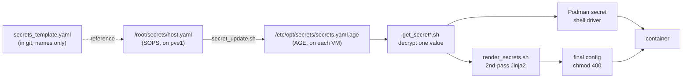

# Encrypted Homelab Secrets Without a Secrets Server

My homelab repo is public, and it's written to be generic. Real hostnames, domains, and IPs live in a gitignored `vars.yml`, and the committed examples use placeholder values. Secrets stay out of git for the same reason. Each VM gets one encrypted secrets file on its own disk, and values are decrypted only when a container starts.

The pieces are SOPS, AGE, and Podman's shell secrets driver. There's no extra service to run.

<!-- more -->

## Why not a secrets manager?

A dedicated secrets manager is the usual way to handle this, and for a team it's the right choice. For one person it's a lot of overhead. It's a stateful, always-on service with its own authentication, backups, and uptime, and every other service depends on it being reachable at startup. The reasoning is written up in an architecture decision record (ADR 0004).

## Why not Podman's default secrets?

Podman has built-in secrets, and quadlets can reference them with a `Secret=` line. The problem is the default `file` driver. `podman secret create` stores the value unencrypted in a JSON file under Podman's storage directory. Only root can read that file, but anyone with a copy of the VM's disk or one of its backups can read every secret. It would also be one more copy of each value to update by hand on every VM.

I still use Podman secrets, just with a different driver.

## Where the secrets live

There are two kinds of secrets files:

- **Source files on pve1.** pve1 holds the trust roots for the whole lab, so it also keeps one secrets file per VM at `/root/secrets/<host>.yaml`. These are SOPS files encrypted to pve1's AGE key. SOPS encrypts only the values and leaves the key names readable, so I can see which secrets a file holds without decrypting it.
- **A deployed file on each VM.** Each VM has `/etc/opt/secrets/secrets.yaml.age`, encrypted with AGE to two recipients: pve1's key and the VM's own ed25519 SSH key. SOPS can't use SSH keys as recipients, so the update script decrypts the SOPS file and re-encrypts it with the `age` CLI. The VM's private key sits next to the file in a root-only directory.

Git only has a `secrets_template.yaml` for each VM. It lists every secret name with an empty value, with a comment above each one showing the command I used to generate it. When I rebuild a VM, the template tells me which secrets need to exist.



## Getting secrets into containers

There are two paths, depending on how the app reads its secrets.

**Path 1: Podman secrets with the shell driver.** Instead of using the default file driver, Podman can call your own scripts to list and look up secrets:

```toml
[secrets]
driver = "shell"

[secrets.opts]
list = '/usr/local/bin/list_secrets.sh'
lookup = '/usr/local/bin/get_secret_by_id.sh'
store = 'true'
delete = 'true'
```

The `store` and `delete` commands are set to `true`, the shell command that does nothing, so Podman never writes a secret value anywhere. It only keeps a mapping from each secret's name to its ID. When I update a VM's secrets, the update script recreates each Podman secret with a placeholder value to keep those names current. When a container starts, Podman calls `get_secret_by_id.sh`, which decrypts the AGE file and prints the requested value. Quadlets use the normal syntax, like `Secret=authelia_storage_key,type=env,target=AUTHELIA_STORAGE_ENCRYPTION_KEY`, and the value stays encrypted on disk. Most services, including Authelia, get their secrets this way.

**Path 2: the `*.j2.j2` double template.** Some apps only read secrets from their config file. Alertmanager and ntfy are two examples in my lab. Their configs are Jinja2 templates that get rendered twice:

- **Pass 1, at deploy time:** `render_src.sh` fills in the non-secret variables like IPs, hostnames, and usernames. The output is still a template, with placeholders where the secrets go, and it's shipped to the VM that way.
- **Pass 2, at container startup:** an `ExecStartPre=` line runs `render_secrets.sh` with the config path and a list of secret names. The script decrypts those values, renders the final config next to the template, and makes it root-owned with `chmod 400`.

This path leaves plaintext on disk in the rendered config, so I only use it for apps that can't read secrets any other way.

## Updating a secret

On pve1, `secret_update.sh <host>` opens that VM's SOPS file in `$EDITOR`. After I save, the script re-encrypts the file for the VM, copies it over SSH, moves it into place, and recreates the Podman placeholder secrets. Then I restart the services that use the changed values.

## Tradeoffs

- **pve1's AGE key is the most important key.** It decrypts the source file for every VM. If a VM's key is lost, I can generate a new one and run the update script again. If pve1's key is lost with no backup, I'd have to recover the values from each VM's copy or regenerate them.
- **Git isn't a backup for secrets.** Rebuilding a VM takes the repo, `vars.yml`, the SOPS files, and pve1's AGE key. Git only has the repo, so the rest need their own backups.
- **There's no audit log.** A secrets manager records who read which secret and when, and a file can't do that. That's fine for one person and a dealbreaker for a team.
- **Rotation means editing, redistributing, and restarting,** not a live swap. At homelab scale that isn't a problem.

In return, there's no extra service to run and nothing that has to be up before the rest of the lab can start. Quadlets use Podman secrets with the standard syntax, and Podman never stores a plaintext copy.

The scripts are in [the repo](https://github.com/babraham123/homelab). `src/podman/` has the lookup and render scripts and `containers.conf`, `src/pve1/secret_update.sh` handles distribution, and ADR 0004 explains the decision.
