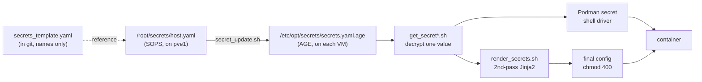

# Encrypted Homelab Secrets Without a Secrets Manager

My homelab keeps its secrets encrypted on disk without running a secrets manager. Each VM gets one encrypted secrets file, values are decrypted only when a container starts, and there's no extra service to keep alive. If you run containers on a few machines and want secrets out of git without deploying a full secrets platform, this setup is easy to drop in.

The pieces are SOPS (a tool that encrypts the values in a YAML file but leaves the keys readable), AGE (a simple file-encryption tool with short keys), and Podman's shell secrets driver. My repo is public, so this also keeps real values out of git, the same way real hostnames and IPs live in a gitignored `vars.yml`.

<!-- more -->

<figure class="post-hero" markdown>
{ width="1600" height="900" loading="lazy" }
<figcaption>Photo by me on a recent trip: the night sky is beautiful, like a well-encrypted file.</figcaption>
</figure>

## Why not a secrets manager?

A dedicated secrets manager is the usual way to handle this, and for a team it's the right choice. For one person it's a lot of overhead. It's a stateful, always-on service with its own authentication, backups, and uptime, and every other service depends on it being reachable at startup. The reasoning is written up in [a design note](https://github.com/babraham123/homelab/blob/main/docs/adr/0004-sops-age-secrets.md) in the repo.

## Why not Podman's default secrets?

Podman has built-in secrets, and quadlets can reference them with a `Secret=` line. The problem is the default `file` driver. `podman secret create` stores the value unencrypted in a JSON file under Podman's storage directory. Only root can read that file, but anyone with a copy of the VM's disk or one of its backups can read every secret. It also means manually updating the copied values on every VM.

I still use Podman secrets, just with a different driver.

## Where the secrets live

There are two kinds of secrets files:

- **Source files on pve1.** pve1 is the always-on Proxmox host that holds the trust roots for the whole lab (its certificate authorities and keys), so it also keeps one SOPS file per VM, encrypted to pve1's AGE key. SOPS encrypts only the values, so I can see which secrets a file holds without decrypting it.
- **A deployed file on each VM,** encrypted with AGE to two recipients: pve1's key and the VM's own SSH key. Only root on that VM can read the key that decrypts it.

Git just holds a template for each VM with empty values, so I know which secrets need to exist during a rebuild.


```mermaid
flowchart LR
    tmpl["secrets_template.yaml<br/>(in git, names only)"]
    src["/root/secrets/host.yaml<br/>(SOPS, on pve1)"]
    age["/etc/opt/secrets/secrets.yaml.age<br/>(AGE, on each VM)"]
    gs["get_secret*.sh<br/>decrypt one value"]
    ps["Podman secret<br/>shell driver"]
    rs["render_secrets.sh<br/>2nd-pass Jinja2"]
    cfg["final config<br/>chmod 400"]
    c["container"]

    tmpl -.->|"reference"| src
    src -->|"secret_update.sh"| age
    age --> gs
    gs --> ps --> c
    gs --> rs --> cfg --> c
```

## Getting secrets into containers

There are two paths, depending on how the app reads its secrets.

**Path 1: Podman secrets with the shell driver.** Instead of using the default file driver, Podman can call your own scripts to list and look up secrets:

```toml
[secrets]
driver = "shell"

[secrets.opts]
list = '/usr/local/bin/list_secrets.sh'
lookup = '/usr/local/bin/get_secret_by_id.sh'
store = 'true'
delete = 'true'
```

Podman only keeps a mapping from each secret's name to its ID. When a container starts, Podman calls `get_secret_by_id.sh`, which decrypts the AGE file and prints the requested value. Quadlets use the normal syntax, like `Secret=authelia_storage_key,type=env,target=AUTHELIA_STORAGE_ENCRYPTION_KEY`, and the value stays encrypted on disk. Most services, including Authelia, get their secrets this way.

**Path 2: the `*.j2.j2` double template.** Some apps only read secrets from their config file. Alertmanager and ntfy are two examples in my lab. Their configs are Jinja2 templates that get rendered twice:

- **Pass 1, at deploy time:** `render_src.sh` fills in the non-secret variables like IPs, hostnames, and usernames. The output is still a template, with placeholders where the secrets go, and it's shipped to the VM that way.
- **Pass 2, at container startup:** an `ExecStartPre=` line runs `render_secrets.sh` with the config path and a list of secret names. The script decrypts those values, renders the final config next to the template, and makes it root-owned with `chmod 400`.

This leaves plaintext on disk, so it's a last resort for apps that refuse to read secrets any other way.

## Updating a secret

On pve1, `secret_update.sh <host>` opens that VM's SOPS file in `$EDITOR`. After I save, the script re-encrypts the file for the VM, copies it over SSH, moves it into place, and recreates the Podman placeholder secrets. Then I restart the services that use the changed values.

## Tradeoffs

- **pve1's AGE key is the most important key, and git doesn't back it up.** It decrypts the source file for every VM, and rebuilding a VM takes it along with the SOPS files and `vars.yml`. These go to my Proxmox Backup Server weekly, but that backup is encrypted with its own offline key. If I lose both keys, I'd have to scrape the values from each VM or regenerate them from scratch.
- **There's no audit log.** A secrets manager records who read which secret and when, and a file can't do that. That's fine for one person and a dealbreaker for a team.
- **Rotation means editing, redistributing, and restarting,** not a live swap. At homelab scale that isn't a problem.

The scripts are in [the repo](https://github.com/babraham123/homelab). `src/podman/` has the lookup and render scripts and `containers.conf`, `src/pve1/secret_update.sh` handles distribution, and the design note explains the decision.
