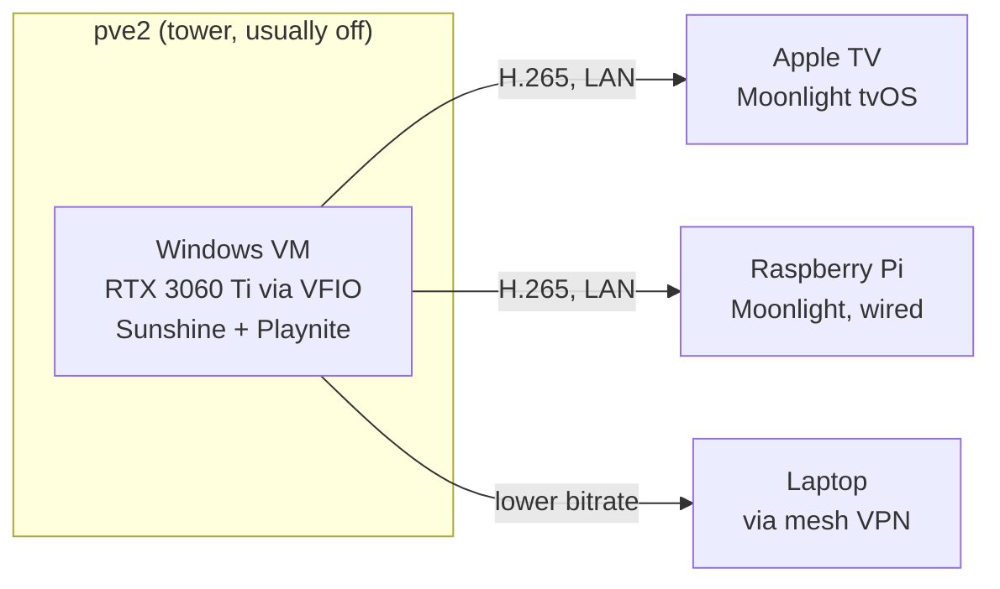

# The Invisible Gaming PC: GPU Passthrough and Sunshine Streaming

There's a Windows gaming machine in my house that nobody has ever seen. It's a VM on a Proxmox server with an RTX 3060 Ti passed through to it, no monitor, no desk — games stream to the Apple TV in the living room, a Raspberry Pi, or my laptop over VPN, via Sunshine and Moonlight.

This is the most "because I can" part of the homelab, and also the setup with the most sharp edges. Here's what worked.

<!-- more -->

## The idea

The server (`pve2`: an i5-13500 tower) already existed for other workloads. Adding a GPU and a Windows VM turns it into a gaming PC that lives wherever there's a screen — with the added party trick that the machine is *off* most of the time. When I want to play, an OliveTin button on my phone sends wake-on-LAN through the homelab's automation pipeline, and a couple of minutes later Moonlight finds the VM.

## Passthrough: the fussy part

GPU passthrough (VFIO) gives the VM exclusive, native access to the physical GPU. The hard-won lessons, compressed:

- **IOMMU groups are destiny.** The GPU and its HDMI audio function must be passable as a unit — and the audio device *must* come along, or you get video with no sound and a confusing afternoon.
- **Set the VM's virtual display to `none`.** Leave a virtual display attached and Sunshine may happily encode *that* instead of the GPU output. Symptom: a black stream and no error anywhere.
- **VirtIO drivers** for disk and network are the difference between a gaming PC and a slideshow.
- **Hookscripts** (Proxmox's VM start/stop hooks that bind/unbind the GPU) fail silently when misconfigured — worth testing in isolation before blaming anything else.

The host keeps the CPU's integrated graphics for its own console, so the Nvidia card belongs entirely to the VM.

## Sunshine, Moonlight, and the couch

Sunshine (the open-source successor to NVIDIA's abandoned GameStream) runs on the VM and encodes with NVENC — hardware encoding, so streaming barely dents game performance. Moonlight clients pair via PIN.

Two client notes: install **ViGEmBus** on Windows *before* pairing controllers — it's the virtual gamepad driver that makes Moonlight's forwarded input appear as a real Xbox controller. And **Playnite** as a launcher makes the couch experience coherent: Steam, GOG, and emulators in one full-screen UI navigable from a gamepad.

Latency, measured honestly: wired Raspberry Pi is nearly indistinguishable from native at 1080p60. Apple TV on 5 GHz WiFi is a consistent 10–20 ms — fine for everything except twitchy competitive shooters. Remote over the VPN lands around 40–80 ms: great for slower games on the road, not for anything demanding.

## The weird part: administering Windows like a Linux box

The VM has no monitor, so it gets managed like every other node in the lab — over SSH (yes, Windows runs OpenSSH fine), with host certificates signed by the homelab's internal SSH CA so clients trust it automatically. It even participates in the lab's [restricted automation pattern](https://github.com/babraham123/homelab): a PowerShell dispatcher accepts only a whitelisted set of remote commands, the same forced-command model the Linux nodes use. That's how "wake the gaming VM" gets to be a phone button without any credential that could run arbitrary commands.

## Worth doing?

If you want maximum-FPS competitive gaming: no, buy a console or a desktop. If you like the idea of one server that's a game console in the living room, a retro machine in the bedroom, and a full Windows PC on your laptop three time zones away — while drawing zero watts most of the week — this setup has been genuinely reliable once past the passthrough gauntlet. The sharp edges are all in the first weekend.
