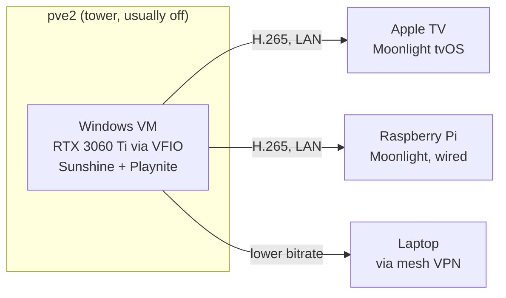

# The Invisible Gaming PC: GPU Passthrough and Sunshine Streaming

There's a Windows gaming machine in my house that nobody has ever seen. It's a VM on a Proxmox server with an RTX 3060 Ti passed through to it. It has no monitor and no desk. Games stream over Sunshine and Moonlight to the Apple TV in the living room, a Raspberry Pi, or my laptop over VPN.

I built this mostly because I could, and it has more rough edges than anything else in the homelab. This post covers what ended up working.

<!-- more -->

## The idea

The server (`pve2`, an i5-13500 tower) already existed for other workloads. Adding a GPU and a Windows VM turned it into a gaming PC that works wherever there's a screen. It's also powered off most of the time. When I want to play, I tap an OliveTin button on my phone, which sends wake-on-LAN through the homelab's automation pipeline. A couple of minutes later, Moonlight finds the VM.

## Passthrough is the fussy part

GPU passthrough (VFIO) gives the VM exclusive, native access to the physical GPU. The main things I learned:

- **Check your IOMMU groups first.** The GPU and its HDMI audio function need to be passed through together. If the audio device doesn't come along, you get video with no sound and a confusing afternoon.
- **Set the VM's virtual display to `none`.** If a virtual display is still attached, Sunshine may encode that instead of the GPU output. You'll see a black stream and no error anywhere.
- **Use VirtIO drivers** for disk and network. Without them the VM is painfully slow.
- **Test hookscripts on their own.** These are Proxmox's VM start/stop hooks that bind and unbind the GPU, and they fail silently when misconfigured.

The host keeps the CPU's integrated graphics for its own console, so the Nvidia card belongs entirely to the VM.

## Sunshine, Moonlight, and the couch

Sunshine is an open-source replacement for NVIDIA's discontinued GameStream. It runs on the VM and encodes with NVENC, which is hardware encoding, so streaming has very little impact on game performance. Moonlight clients pair with a PIN.

Two client notes. First, install **ViGEmBus** on Windows before pairing controllers. It's the virtual gamepad driver that makes Moonlight's forwarded input show up as a real Xbox controller. Second, **Playnite** makes a good launcher for the couch: Steam, GOG, and emulators all in one full-screen UI you can navigate with a gamepad.

As for latency, a wired Raspberry Pi is nearly indistinguishable from native at 1080p60. The Apple TV on 5 GHz WiFi adds a consistent 10-20 ms, which is fine for everything except fast competitive shooters. Remote play over the VPN lands around 40-80 ms. That's great for slower games while traveling but not for anything demanding.

## Administering Windows like a Linux box

Since the VM has no monitor, I manage it like every other node in the lab: over SSH. Windows runs OpenSSH fine, and the VM uses host certificates signed by the homelab's internal SSH CA, so clients trust it automatically. It also follows the lab's [restricted automation pattern](https://github.com/babraham123/homelab). A PowerShell dispatcher accepts only a whitelisted set of remote commands, the same forced-command model the Linux nodes use. That's how "wake the gaming VM" can be a button on my phone without any credential that could run arbitrary commands.

## Should you build one?

If you want maximum FPS for competitive gaming, no. Buy a console or a desktop. But if you like the idea of one server acting as a game console in the living room, a retro machine in the bedroom, and a full Windows PC on your laptop three time zones away, while drawing zero watts most of the week, this setup has been reliable for me. Almost all of the pain was in getting passthrough working that first weekend.
