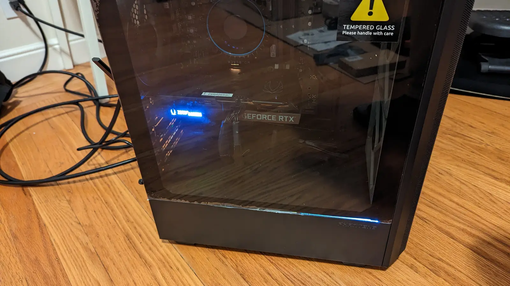
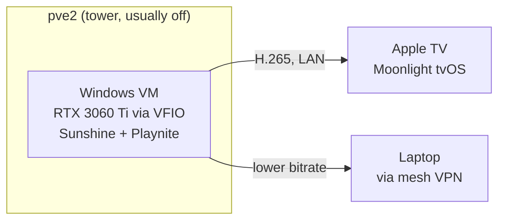

# The Invisible Gaming PC: GPU Passthrough and Sunshine Streaming

There's a Windows gaming machine in my house that nobody has ever seen. It's a VM on a Proxmox server with an RTX 3060 Ti passed through to it. It has no monitor and no desk. Games stream over Sunshine and Moonlight to the Apple TV in the living room or to my laptop over VPN.

I built this mostly because I could, and it has more rough edges than anything else in the homelab. This post covers what ended up working.

<!-- more -->

<figure class="post-hero" markdown>
{ width="1600" height="900" loading="lazy" }
<figcaption>Photo by me: homelab hardware that, unlike most of it, has a glowing logo nobody gets to see.</figcaption>
</figure>

## The idea

I already had the server (`pve2`, an i5-13500 tower) running other stuff. Adding a GPU and a Windows VM turned it into a gaming PC that works wherever there's a screen. It's also powered off most of the time. When I want to play, I tap a button on my phone in OliveTin (a self-hosted web UI that turns shell commands into buttons), which sends wake-on-LAN through the homelab's automation pipeline. A couple of minutes later, Moonlight finds the VM.

```mermaid
flowchart LR
    subgraph pve2["pve2 (tower, usually off)"]
        vm["Windows VM<br/>RTX 3060 Ti via VFIO<br/>Sunshine + Playnite"]
    end
    atv["Apple TV<br/>Moonlight tvOS"]
    lap["Laptop<br/>via mesh VPN"]
    vm -->|"H.265, LAN"| atv
    vm -->|"lower bitrate"| lap
```

## Passthrough is the fussy part

GPU passthrough (VFIO) gives the VM exclusive, native access to the physical GPU. Here are the biggest gotchas:

- **Check your IOMMU groups first.** An IOMMU group is the smallest set of PCI devices the hardware can isolate from each other, and a VM has to get the whole group. The GPU and its HDMI audio function usually share a group, so they need to be passed through together. If the audio device doesn't come along, you get video with no sound and a confusing afternoon.
- **Set the VM's virtual display to `none`.** If a virtual display is still attached, Sunshine may encode that instead of the GPU output. You'll see a black stream and no error anywhere.
- **Test hookscripts on their own.** These are Proxmox's VM start/stop hooks that bind and unbind the GPU, and they fail silently when misconfigured.

The host keeps the CPU's integrated graphics for its own console. The Nvidia card goes to one VM at a time: the hookscript shuts down my Linux desktop VM and unbinds the card before the gaming VM starts, and hands it back afterward.

## Sunshine, Moonlight, and the couch

Sunshine is an open-source replacement for NVIDIA's discontinued GameStream. It runs on the VM and uses NVENC for hardware-accelerated encoding, so the stream barely touches game performance. Moonlight clients pair with a PIN.

As for latency, playing on a wired Raspberry Pi at 1080p60 felt almost indistinguishable from playing natively. My current setup, an Apple TV on 5 GHz WiFi, adds a steady 10-20 ms—fine for everything except fast competitive shooters. Remote play over the VPN lands around 40-80 ms. That's great for slower games while traveling but not for anything demanding.

## Administering Windows like a Linux box

Since the VM has no monitor, I manage it like every other node in the lab: over SSH, with a [PowerShell dispatcher](https://github.com/babraham123/homelab/blob/main/src/gaming/Dispatcher.ps1.j2) that only accepts a short list of commands (mostly starting and stopping Sunshine). The "start gaming" button on my phone chains three of those commands across the router, pve2, and the VM, and none of the credentials involved can run arbitrary commands. [A separate post](ssh-dispatcher.md) covers how that works.

## Should you build one?

If you want maximum FPS for competitive gaming, no. Buy a console or a desktop. But if you like the idea of a single server acting as a living room console and a remote gaming rig while drawing zero watts most of the week, this setup has been rock solid. Almost all of the pain was in getting passthrough working that first weekend.
