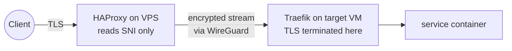

# One Config File Against the Internet: HAProxy as a Security Chokepoint

My homelab has exactly one machine with a public IP: the smallest Linode instance available, running HAProxy on ports 80 and 443. Every request from the internet — legitimate or otherwise — passes through one config file before it can touch anything I care about.

That file does SNI routing, rate limiting, sticky banning, geo-blocking, and attack-path filtering. Here's how, and why the design assumes the VPS itself will eventually be compromised.

<!-- more -->

## The core decision: never terminate TLS at the edge

The conventional setup terminates TLS at the edge proxy. I didn't, and it's the most important line in the design: the VPS is the most exposed, least trusted machine in the system, so it never holds a private key and never sees plaintext.

Instead, HAProxy's 443 frontend runs in **TCP mode**. It waits for the TLS ClientHello, reads the SNI (the hostname the client is asking for), and routes the *still-encrypted* stream over a WireGuard mesh to the right VM at home, where Traefik terminates TLS. PROXY protocol v2 carries the real client IP along.

If someone roots the VPS, they get traffic metadata — SNI names and IPs. No keys, no plaintext. The tradeoff: no WAF-style inspection of HTTPS contents at the edge. I'll take it.

## Layer 4: making scanners regret it

The 443 frontend tracks every source IP in a stick table. More than 30 concurrent connections, or a connection rate over 50 per 3 seconds, triggers `silent-drop` — HAProxy just stops responding. No RST, no error. The client waits for a timeout that will never come, which is both cheaper for me and slower for them.

A 5-second `inspect-delay` while waiting for the ClientHello has a pleasant side effect: naive port scanners burn five seconds per probe.

## Layer 7: the HTTP frontend

Plain HTTP gets full request inspection (it's not encrypted, so why not), and this is where the internet's background radiation shows up. Three filters:

- **Attack-path filtering.** Requests for `.env`, `.git`, `wp-admin`, `phpmyadmin`, and friends are silently dropped. Nobody legitimate has ever asked my server for `/.aws/credentials`.
- **Sticky banning.** Over 150 requests in 10 seconds flags the source IP in a counter; once flagged, *everything* from that IP is dropped until the table entry expires — even if they slow down. Bursts get caught, and so does throttling down to sneak under the limit.
- **Geo-blocking.** A systemd timer converts the MaxMind GeoIP database into per-country map files daily; countries on my blocklist are dropped with an O(log n) lookup.

What survives all that is mostly Let's Encrypt HTTP-01 challenges, which pass through to Traefik, plus redirects to HTTPS.

The consistent theme is `silent-drop` over rejection. An error page tells a scanner something exists and how it responds. Silence tells them nothing.

## Hardening the box itself

The VPS gets its own care: SSH on a nonstandard port with 22 firewalled outright, fail2ban, and only four open ports (80, 443, STUN, WireGuard). Headscale's admin API listens on localhost only.

## Does it work?

Watching the stick tables live (`echo "show table http_all" | socat stdio /run/haproxy/admin.sock`) is genuinely entertaining: a constant drizzle of scanners hitting the path filters and rate limits, none of it ever reaching an application. No web framework, no container, no CPU spent on garbage — just HAProxy discarding it at line rate.

The honest limitation: this is all connection- and path-level filtering. Anything targeting an actual application flaw arrives looking like a legitimate request, and defense there belongs to the SSO layer ([previous post](self-hosted-sso.md)) and the apps themselves. The edge's job is narrower: make the noise disappear. It does.

Config template: [`src/haproxy/haproxy.cfg.j2`](https://github.com/babraham123/homelab) in the repo, with the reasoning in ADR 0002.
