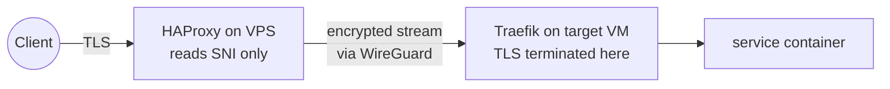

# One Config File Against the Internet: HAProxy as a Security Chokepoint

My homelab has exactly one machine with a public IP: the smallest Linode instance available, running HAProxy on ports 80 and 443. Every request from the internet, legitimate or not, passes through one config file before it can reach anything I care about.

That file handles SNI routing, rate limiting, sticky banning, geo-blocking, and filtering of common attack paths. This post walks through each of those, and explains why the design assumes the VPS will eventually be compromised.

<!-- more -->

<figure class="post-hero" markdown>
{ width="1600" height="900" loading="lazy" }
<figcaption>Photo by me on a recent trip: a whole river squeezed through one narrow gap, which is how all of my public traffic gets in.</figcaption>
</figure>

## Never terminate TLS at the edge

The usual setup terminates TLS at the edge proxy. I didn't, and it's the most important decision in the design. The VPS is the most exposed and least trusted machine in the system, so it never holds a private key and never sees plaintext.

HAProxy's 443 frontend runs in **TCP mode** instead. It waits for the TLS ClientHello, reads the SNI (the hostname the client is asking for), and routes the still-encrypted stream over a WireGuard mesh to the right VM at home, where Traefik terminates TLS. PROXY protocol v2 passes the real client IP along.

If someone gets root on the VPS, they get traffic metadata: SNI names and IPs. They don't get keys or plaintext. The cost is that I can't do WAF-style inspection of HTTPS traffic at the edge, which I'm fine with.

## Layer 4: slowing down scanners

The 443 frontend tracks every source IP in a stick table. More than 30 concurrent connections, or more than 50 new connections in 3 seconds, triggers `silent-drop`, and HAProxy stops responding. It sends no RST and no error, so the client waits for a timeout. That costs me almost nothing and wastes the scanner's time.

There's also a 5-second `inspect-delay` while waiting for the ClientHello. A side effect is that naive port scanners spend five seconds on every probe.

## Layer 7: the HTTP frontend

Plain HTTP isn't encrypted, so it gets full request inspection. This is where most of the internet's background noise shows up. There are three filters:

- **Attack-path filtering.** Requests for `.env`, `.git`, `wp-admin`, `phpmyadmin`, and similar paths are silently dropped. No legitimate visitor has ever asked my server for `/.aws/credentials`.
- **Sticky banning.** More than 150 requests in 10 seconds flags the source IP in a counter. Once an IP is flagged, all of its traffic is dropped until the table entry expires, even if it slows down. This catches bursts, and it also catches clients that try to throttle themselves to stay under the limit.
- **Geo-blocking.** A systemd timer converts the MaxMind GeoIP database into per-country map files every day. Requests from countries on my blocklist are dropped with an O(log n) lookup.

Most of what gets through is Let's Encrypt HTTP-01 challenges, which pass through to Traefik, and redirects to HTTPS.

Throughout the config I use `silent-drop` instead of returning errors. An error page tells a scanner that something is there and shows how it responds. Dropping the connection tells it nothing.

## Hardening the box itself

The VPS has its own hardening: SSH on a nonstandard port with 22 blocked at the firewall, fail2ban, and only four open ports (80, 443, STUN, and WireGuard). Headscale's admin API listens only on localhost.

## Results

Watching the stick tables live (`echo "show table http_all" | socat stdio /run/haproxy/admin.sock`) is pretty entertaining. There's a steady stream of scanners hitting the path filters and rate limits, and none of it reaches an application. No web framework or container spends CPU on it, because HAProxy discards it first.

This is all filtering at the connection and path level, though. An attack on an actual application bug will look like a normal request, and defending against that is the job of the SSO layer ([previous post](self-hosted-sso.md)) and the apps themselves. The edge has a narrower job, which is getting rid of the noise, and it does that well.

The config template is [`src/haproxy/haproxy.cfg.j2`](https://github.com/babraham123/homelab) in the repo, and ADR 0002 explains the reasoning.
