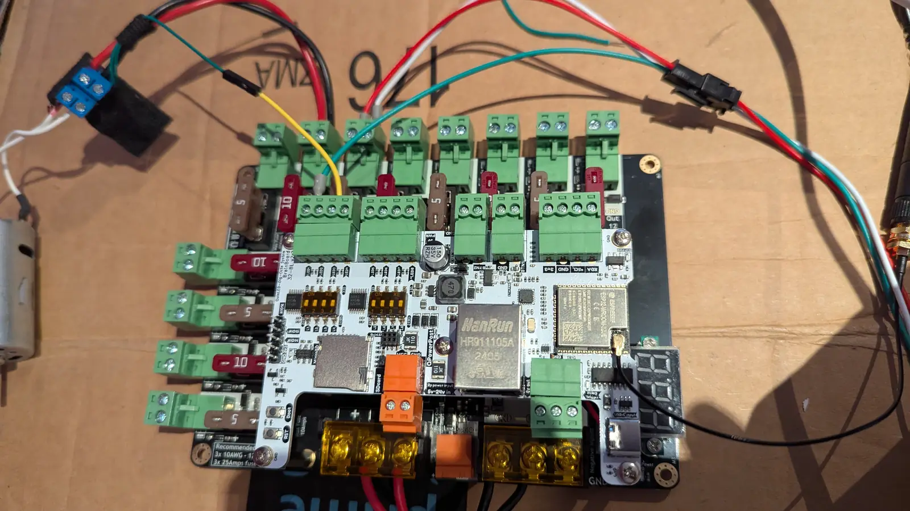

# When mDNS Breaks Everything: A Cross-VLAN Debugging Story

After a network reconfiguration, Zigbee2MQTT couldn't reach the MQTT broker anymore. Home Assistant entities went stale, automations stopped running, and the smart lights stopped being smart. The broker was healthy and the firewall rules were correct. The problem looked like three different things before it turned out to be two other problems stacked on top of each other.

I [wrote previously](vlans-and-mdns.md) about how VLAN segmentation breaks mDNS discovery and the repeater setup that fixes it. This follow-up is about what debugging that setup looks like when it fails without any errors.

<!-- more -->

<figure class="post-hero" markdown>
{ width="1600" height="900" loading="lazy" }
<figcaption>Photo by me: circuits from an unrelated project, which involved zero mDNS and was much more relaxing.</figcaption>
</figure>

## The symptom

Zigbee2MQTT finds the broker through mDNS (`_mqtt._tcp.local`) and was logging a connection refusal. Services in my lab find each other through advertisements instead of hardcoded IPs, so changing an IP doesn't break any configs. That's convenient until discovery itself breaks, because mDNS failures don't produce errors. Things just don't show up.

## Hypothesis 1: the firewall (wrong)

The services are on different subnets, so mDNS traffic has to cross a boundary, which made the firewall the obvious suspect. The pfSense rules for UDP/5353 looked correct, but rules that look right on paper don't prove anything, so I ran `tcpdump -i eth0 udp port 5353` on the destination. No packets were arriving. They weren't leaving the source either, and a firewall can't block packets that are never sent. So it wasn't the firewall.

That was the first real lesson: with mDNS, start with tcpdump right away. Capturing at the source, the boundary, and the destination narrows the problem down in a few minutes.

## Hypothesis 2: the repeater (half right)

The mdns_repeater service forwards multicast traffic across the boundary. `systemctl status` showed it running with no errors. But its config binds to interfaces by name, and the network reconfiguration had changed a Linux interface name (`eth0` → `enp2s0`-style predictable naming). The repeater was listening on an interface that no longer existed and not reporting any problem. I updated the config and restarted it, and tcpdump confirmed packets were now crossing the boundary.

Discovery still failed.

## Hypothesis 3: something was answering first

If packets are arriving but the application still can't see the service, something between the network and the app is interfering. `ps aux` showed **avahi-daemon** running. I had never installed it. It had been pulled in as a dependency of some other package and started by default, which Debian does.

Avahi is a full mDNS responder. It answers queries itself, using its own records, and those records knew nothing about services on other subnets. It was answering queries locally with "no such service" before the repeated responses from the other VLAN could matter. So there were two silent failures: the interface rename broke the transport, and Avahi hid the fact that the transport was fixed.

```bash
systemctl disable --now avahi-daemon
```

After that, the lights worked again.

## A 20-line probe script

Debugging this by restarting Zigbee2MQTT over and over was painful. Each cycle was slow and the logs were noisy. To avoid that in the future I wrote a small Node.js probe using the `multicast-dns` package. You give it a service type and an interface, and it sends one query and prints every response.

```bash
node mdns.js _mqtt._tcp.local eth0
```

Running it from any VLAN shows exactly what's discoverable from there. I can test the repeater, the firewall, and the advertiser separately without involving production services. It lives in the repo's `test/` directory and has saved me time on several problems since.

## Lessons

- **After any network change, check interface names first.** Linux renames interfaces for many reasons, and any config that binds by name will break without an error.
- **Run tcpdump before forming theories.** Multicast has no error path, so packet captures are the only reliable source of information.
- **Don't run Avahi and an mDNS repeater on the same host.** Check for Avahi even if you never installed it yourself. That's exactly the situation where it catches you.
- **mDNS discovery across subnets is fragile by design.** For infrastructure services I've since moved to stable DNS names in Unbound, and mDNS is left for consumer devices that actually need it.

The whole thing took one evening. With the probe script and this process, it would take about ten minutes now.
