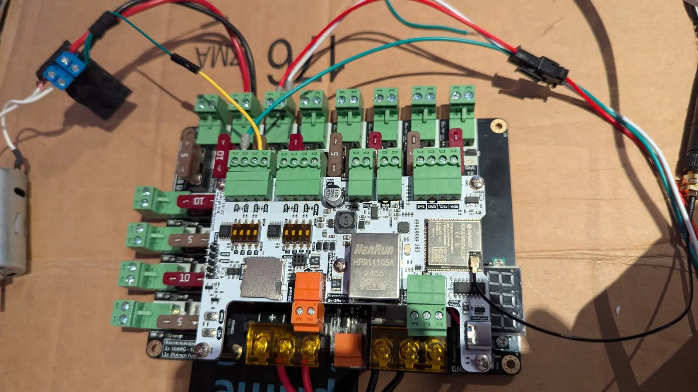

# When mDNS Breaks Everything: A Cross-VLAN Debugging Story

After a network reconfiguration, Zigbee2MQTT couldn't reach its Zigbee coordinator anymore. Home Assistant entities went stale, automations stopped running, and the smart lights stopped being smart. The coordinator was powered up and the firewall rules were correct. The problem looked like three different things before it turned out to be two other problems stacked on top of each other.

I [wrote previously](vlans-and-mdns.md) about how VLAN segmentation breaks mDNS discovery and the repeater setup that fixes it. This follow-up is about what debugging that setup looks like when it fails without any errors.

<!-- more -->

<figure class="post-hero" markdown>
{ width="1600" height="900" loading="lazy" }
<figcaption>Photo by me: circuits from an unrelated project, which involved zero mDNS and was much more relaxing.</figcaption>
</figure>

## The symptom

Zigbee2MQTT finds its network Zigbee coordinator (an SLZB-06) through mDNS (`_slzb-06._tcp.local`) and was logging that the coordinator was unreachable. It looks the coordinator up by its advertisement instead of a hardcoded IP, so changing the IP doesn't break any configs. That's convenient until discovery itself breaks, because mDNS failures don't produce errors. Things just don't show up.

## Hypothesis 1: the firewall (wrong)

The services are on different subnets, so mDNS traffic has to cross a boundary, which made the firewall the obvious suspect. The pfSense rules for UDP/5353 looked correct, but rules that look right on paper don't prove anything, so I ran `tcpdump -i eth0 udp port 5353` on the destination. No packets were arriving. They weren't leaving the source either, and a firewall can't block packets that are never sent. So it wasn't the firewall.

## Hypothesis 2: the repeater (half right)

The mdns_repeater service copies multicast traffic between the VM's network card and the container network. `systemctl status` showed it running with no errors. But its config binds to interfaces by name, and the network reconfiguration had changed a Linux interface name (`eth0` → `enp2s0`-style predictable naming). The repeater was silently listening on a ghost interface without throwing a single error. I updated the config and restarted it, and tcpdump confirmed packets were now crossing the boundary.

Discovery still failed.

## Hypothesis 3: something was answering first

If packets are arriving but the app still can't see the service, something else in the stack is eating them. `ps aux` showed **avahi-daemon** running. I had never installed it. Debian had pulled it in as a dependency for some other package and enabled it by default.

Avahi is a full mDNS responder. It answers queries itself, using its own records, and those records knew nothing about services on other subnets. It was immediately failing local queries with "no such service" before the real responses from the other VLAN even had a chance. So there were two silent failures: the interface rename broke the transport, and Avahi hid the fact that the transport was fixed.

```bash
systemctl disable --now avahi-daemon
```

After that, the lights worked again.

## A 30-line probe script

Debugging this by restarting Zigbee2MQTT over and over was painful. Each cycle was slow and the logs were noisy. To avoid that in the future I wrote a small Node.js probe using the `multicast-dns` and `bonjour-service` packages. It sends a couple of queries for the coordinator and prints every response. I run it from a throwaway container on the same Podman network as the app, so it sees exactly what the app sees.

Running it from different networks shows exactly what's discoverable from each. I can test the repeater, the firewall, and the advertiser separately without involving production services. It lives in the repo's `test/` directory and has saved me time on several problems since.

## Lessons

- **Run tcpdump before forming theories.** Multicast has no error path, so packet captures are the only reliable source of information. Capture at the source, the boundary, and the destination.
- **Don't run Avahi and an mDNS repeater on the same host.** Check for Avahi even if you never installed it yourself. That's exactly how it sneaks up on you.
- **mDNS discovery across subnets is fragile by design.** For infrastructure services I've since moved to stable DNS names in Unbound, saving mDNS for the consumer devices that actually rely on it.

The whole thing took one evening. With the probe script and this process, it would take about ten minutes now.
