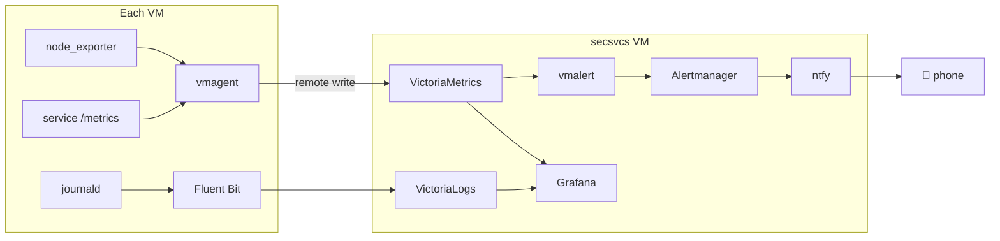

# Metrics and Logs Without the Kubernetes Tax

Most observability tutorials assume you have a Kubernetes cluster, a habit of installing Helm charts, and a platform team. My requirements were simpler. I wanted metrics from every VM and service, centralized searchable logs, and a push notification on my phone when something breaks, all running as plain containers that one person can operate.

The stack is VictoriaMetrics, VictoriaLogs, Fluent Bit, Grafana, and an alert pipeline that ends at ntfy.

<!-- more -->

## Why VictoriaMetrics instead of Prometheus

Prometheus is the default choice, but VictoriaMetrics works better for this use case. It's a drop-in replacement that uses noticeably less memory and compresses storage better, and a single binary handles both storage and queries. It speaks the same PromQL and uses the same Grafana datasource, so nothing downstream needs to change.

Scraping works the opposite way from the usual setup. Instead of one central Prometheus reaching into every VM, a lightweight `vmagent` on each VM scrapes its local targets and remote-writes to the central store. Each VM only needs one outbound connection, and the agents buffer data while the central store restarts, so I can restart VictoriaMetrics without losing data. Logs work the same way: Fluent Bit on each VM tails the systemd journal and forwards it to VictoriaLogs. Every service runs as a systemd unit ([quadlets](podman-quadlets.md)), so journald already has all the logs in one place.

## Generated scrape configs

My favorite thing about this stack is that **scrape configs are generated, not written by hand.** The deploy pipeline renders everything from one variable file, and a parse script pulls each service's endpoints out of its actual config at render time. When I deploy a new service, it's automatically added to monitoring, so there's no separate step to forget. Retention settings for metrics, logs, and Home Assistant history are all in the same `vars.yml`.

pfSense exports router metrics through Telegraf. I also wrote a small custom exporter that serves stock prices, since any data can be exposed in Prometheus format. It's completely unnecessary and I'd recommend it anyway.

## Alerts that reach a person

Nobody watches dashboards all day, so alerts need to reach me. vmalert evaluates rules against VictoriaMetrics and fires to Alertmanager, which routes through a small bridge to **ntfy**. ntfy is a self-hosted push server with a phone app, so notifications arrive right away without email delays or a third-party service. If a service goes down, a disk fills up, or a cert is about to expire, my phone buzzes.

Two reliability details I'd recommend copying:

- **A separate second path.** Gatus probes endpoints over plain HTTP and sends its own alerts, so a broken metrics pipeline can't hide an outage. ([More on Gatus in the next post.](gatus-uptime.md))
- **Three checks for cert expiry.** Gatus, vmalert, and a standalone email timer all watch certificates, with different lead times and delivery methods. Expired certs are one of the most common ways homelabs break without anyone noticing.

Grafana sits on top with both datasources, protected by [SSO](self-hosted-sso.md) with group-to-role mapping. I have around fifteen dashboards: per-VM overviews, Traefik request rates, auth events, Home Assistant entities, and router interfaces.

## What I left out

There's no distributed tracing. At this scale I already know which services talk to each other because I connected them. There's no anomaly detection either, just thresholds. VictoriaLogs' query UI is functional but not very polished, although it has been getting better.

The whole thing is eight small containers on one VM, managed with `systemctl`, using very little RAM. You don't need a platform team for good observability. A solid pipeline and alerts on your phone go a long way.
