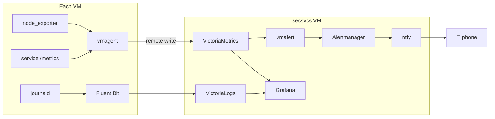

# Metrics and Logs Without the Kubernetes Tax

Most observability tutorials assume you have a Kubernetes cluster, a Helm chart habit, and a platform team. My requirements were simpler: metrics from every VM and service, centralized searchable logs, and a push notification on my phone when something breaks — all running as plain containers a single person can operate.

The stack: VictoriaMetrics, VictoriaLogs, Fluent Bit, Grafana, and an alert pipeline ending at ntfy. Here's the shape of it.

<!-- more -->

## Why VictoriaMetrics instead of Prometheus

Prometheus is the default answer, and VictoriaMetrics is a quiet upgrade for this use case: a drop-in replacement with noticeably lower memory use and better storage compression, in a single binary that stores *and* queries. Same PromQL, same Grafana datasource — nothing downstream knows the difference.

The scraping side inverts the usual model: instead of one central Prometheus reaching into every VM, a lightweight `vmagent` on each VM scrapes its *local* targets and remote-writes to the central store. Each VM only needs one outbound path, and agents buffer during central-store restarts, so I can bounce VictoriaMetrics without losing data. Logs work the same way: Fluent Bit on each VM tails the systemd journal and forwards to VictoriaLogs. Since every service is a systemd unit ([quadlets](podman-quadlets.md)), journald is already the one log stream that has everything.

## The config that writes itself

My favorite property of the whole stack: **scrape configs are generated, not maintained.** The deploy pipeline templates everything from one variable file, and a parse script extracts each service's endpoints from its actual config at render time. Deploying a new service automatically enrolls it in monitoring — there is no "add it to Prometheus" step to forget. Retention for metrics, logs, and Home Assistant history all live in the same `vars.yml`.

Even pfSense participates, exporting router metrics via Telegraf. And because Prometheus metrics are just a format, so does a small custom exporter that serves stock tickers — completely unnecessary, highly recommended.

## Alerts that reach a human

A dashboard nobody watches is decoration. The pipeline that matters: vmalert evaluates rules against VictoriaMetrics, fires to Alertmanager, which routes through a small bridge to **ntfy** — a self-hosted push server whose phone app delivers notifications with no email lag and no third-party service. Service down, disk filling, cert expiring: phone buzzes.

Two reliability details worth stealing:

- **An independent second path.** Gatus probes endpoints over plain HTTP with its own alerting, so a broken metrics pipeline can't mean silent outages. ([More on Gatus next post.](gatus-uptime.md))
- **Cert expiry is watched three ways** — Gatus, vmalert, and a standalone email timer — with different lead times and transports. Expired certs are how homelabs die quietly.

Grafana sits on top with both datasources, protected by [SSO](self-hosted-sso.md) with group-to-role mapping. Fifteen-ish dashboards: per-VM overviews, Traefik request rates, auth events, Home Assistant entities, router interfaces.

## What's deliberately missing

No distributed tracing — at this scale I know which service talked to which because I wired them. No anomaly detection, just thresholds. And VictoriaLogs' query UX is more functional than polished, though it's improved steadily.

Total footprint: eight small containers on one VM, operated with `systemctl` and negligible RAM. Observability doesn't need a platform team — it needs one good pipeline and a phone that buzzes.
