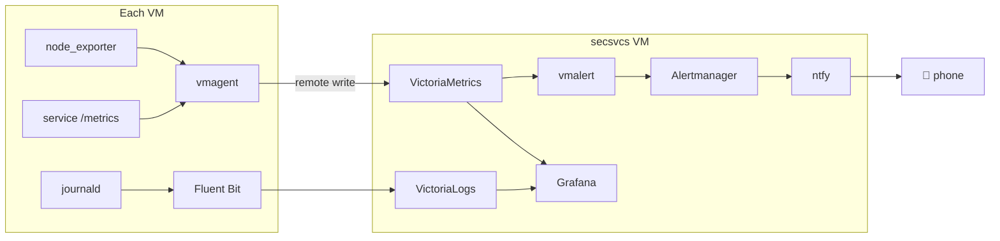

# Metrics and Logs Without the Kubernetes Tax

Most observability tutorials assume you have a Kubernetes cluster, a habit of installing Helm charts, and a platform team. My requirements were simpler. I wanted metrics from every VM and service, centralized searchable logs, and a push notification on my phone when something breaks, all running as plain containers that one person can operate.

The stack consists of VictoriaMetrics, VictoriaLogs, Fluent Bit, and Grafana, with an alert pipeline ending at ntfy.

<!-- more -->

<figure class="post-hero" markdown>
{ width="1600" height="900" loading="lazy" }
<figcaption>Photo by me at a science museum. The Hubble takes observability a bit further than Grafana does.</figcaption>
</figure>

## Why VictoriaMetrics instead of Prometheus

Prometheus is the default choice, but VictoriaMetrics works better for this use case. It's a drop-in replacement that uses noticeably less memory and compresses storage better, and a single binary handles both storage and queries. It speaks the same PromQL and uses the same Grafana datasource, so nothing downstream needs to change.

Scraping works the opposite way from the usual setup. Instead of one central Prometheus reaching into every VM, a lightweight `vmagent` on each service VM scrapes its local targets and remote-writes to the central store. (The central VM just scrapes its local services directly.) Each VM only needs one outbound connection, and the agents buffer data while the central store restarts, so I can restart VictoriaMetrics without losing data. Logs work the same way: Fluent Bit on each VM tails the systemd journal and forwards it to VictoriaLogs. Every service runs as a systemd unit ([quadlets](podman-quadlets.md)), so journald already has all the logs in one place.

```mermaid
flowchart LR
    subgraph vm["Each VM"]
        ne["node_exporter"]
        svc["service /metrics"]
        j["journald"]
        vmagent["vmagent"]
        fb["Fluent Bit"]
    end
    subgraph sec["secsvcs VM"]
        vmdb["VictoriaMetrics"]
        vl["VictoriaLogs"]
        va["vmalert"]
        am["Alertmanager"]
        ntfy["ntfy"]
        graf["Grafana"]
    end
    phone["📱 phone"]
    ne & svc --> vmagent -->|remote write| vmdb
    j --> fb --> vl
    vmdb --> va --> am --> ntfy --> phone
    vmdb & vl --> graf
```

## Alerts that reach a person

Nobody watches dashboards all day, so alerts need to reach me. vmalert evaluates rules against VictoriaMetrics and forwards alerts to Alertmanager, which routes through a small bridge to **ntfy**. ntfy is a self-hosted push server with a phone app, so notifications arrive right away without email delays or a third-party service. Today the rules cover the monitoring stack itself, backups, and disk health. Host, service, and cert-expiry rules are next on the list.

Two checks sit outside this pipeline on purpose: [Gatus](gatus-uptime.md) probes every service on its own schedule, and a standalone timer emails me before any certificate expires. A broken metrics pipeline can't hide an outage from either.

Grafana sits on top with both datasources, protected by [SSO](self-hosted-sso.md) with group-to-role mapping. I have about a dozen dashboards: per-VM and Proxmox overviews, auth events, router interfaces, and one for each piece of the monitoring stack.

## What I left out

There's no distributed tracing. At this scale I already know which services talk to each other because I connected them. There's no anomaly detection either, just thresholds. VictoriaLogs' query UI is functional but unpolished, though it's improving. There are also no HTTP access logs or proxy metrics yet, and the VPS that runs my public edge isn't monitored. Those are next on the list.

The whole thing is eight small containers on one VM, managed with `systemctl`, using very little RAM. You don't need a platform team for good observability. A solid pipeline and alerts on your phone go a long way.
