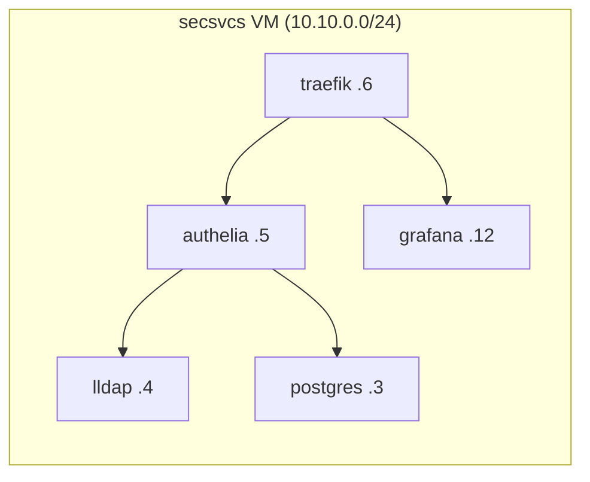

# Skipping Kubernetes: Podman Quadlets and Systemd

My homelab runs about 30 containerized services, including an SSO stack, a metrics pipeline, and Home Assistant. There's no Kubernetes, no k3s, and no Docker Compose. The container orchestrator is systemd, which was already installed.

This post covers Podman quadlets: what they are, what a real unit file looks like, and where the approach stops working.

<!-- more -->

## The problem with the obvious choices

For a homelab run by one person, the list of things you need from an orchestrator is short. It has to start containers at boot, restart them when they fail, handle dependency ordering, and collect logs.

Kubernetes does all of that, but it also brings a control plane, CNI plugins, and a lot of YAML, and one person never really earns back that complexity. Docker Compose is lighter, but it needs its own daemon, and its systemd integration has always felt like an afterthought to me.

systemd already handles lifecycle, restart policies, dependency ordering, and logging for every other process on the machine.

## Enter quadlets

A quadlet is a file like `authelia.container` placed in `/etc/containers/systemd/`. When you run `systemctl daemon-reload`, a Podman generator turns it into a real systemd service. Here's a trimmed version of my actual Authelia unit:

```ini
[Unit]
Requires=lldap.service
Requires=postgres.service
After=network-online.target

[Container]
Image=docker.io/authelia/authelia:4.39
Network=net.network
IP=10.10.0.5
Volume=/etc/opt/authelia/config:/config
Secret=authelia_storage_key,type=env,target=AUTHELIA_STORAGE_ENCRYPTION_KEY
AutoUpdate=registry
NoNewPrivileges=true

[Service]
Restart=on-failure
```

The `[Unit]` section is plain systemd, so Authelia won't start until LLDAP and Postgres are up. The `[Container]` section is Podman-specific. Once the service is running, all the usual tools work:

```bash
systemctl status authelia
journalctl -eu authelia
systemctl restart authelia
```

The main appeal is that there are no new commands or concepts to learn.

## Static IPs instead of service discovery

Besides `.container` files, there are also `.network` and `.volume` quadlets. Each VM defines one bridge network, and every container gets a **static IP** on it:



This sounds primitive compared to DNS-based service discovery, and it is, but that's on purpose. Static IPs make everything downstream predictable. Traefik routes, DNS records, and metrics scrape targets are all generated from the same source at deploy time, and the render pipeline fails the build if two containers claim the same IP. It's simple, and I can grep for any address.

## Secrets

The `Secret=` lines reference Podman secrets, which get populated at deploy time from a SOPS+AGE-encrypted file in git. Some configs need secrets written into the file itself. For those, there's a second-pass template pattern (`*.j2.j2`) that renders at container startup, and the plaintext only exists in memory. That pipeline has [its own post](secrets-in-git.md), and it's my favorite part of the setup.

## Downsides

There are real tradeoffs:

- **No rolling updates.** A restart means a few seconds of downtime. That doesn't matter for a homelab, but it would for anything with real users.
- **No health-check orchestration.** systemd knows when a process has died, but not when an app is hung. External monitoring (Gatus) covers that instead.
- **Limited scale.** This works well at around 30 services. At 300 services across many hosts, you'd end up rebuilding a worse version of Kubernetes.

## Why I'd recommend it

I think quadlets are underrated. If you already know systemd, there's almost nothing new to learn, and there's no orchestrator to run. You don't have a control plane to upgrade or cluster state to lose. The containers are just services, and managing services is a solved problem.

The full unit files are in [the repo](https://github.com/babraham123/homelab) under `src/*/`, with one directory per service.
