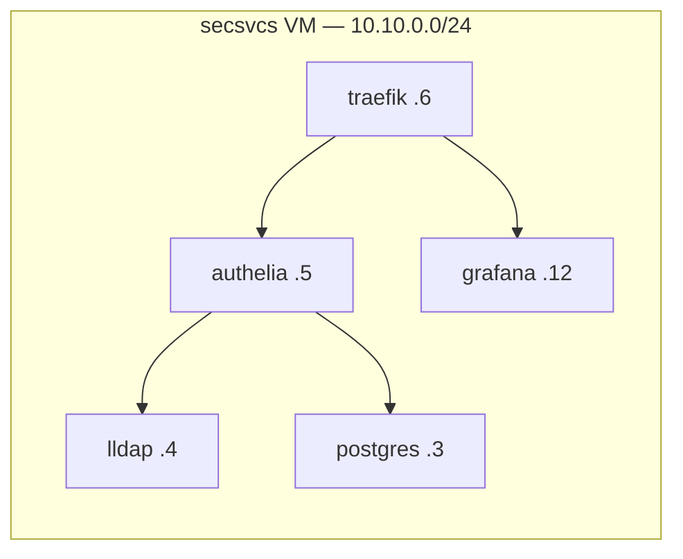

# Skipping Kubernetes: Podman Quadlets and Systemd

My homelab runs ~30 containerized services — an SSO stack, a metrics pipeline, Home Assistant, the works. There is no Kubernetes, no k3s, no Docker Compose. The container orchestrator is systemd, which was already there.

This post is about Podman quadlets: what they are, what a real unit looks like, and where the approach runs out of road.

<!-- more -->

## The problem with the obvious choices

For a single-operator homelab, what you actually need from an orchestrator is short: start containers at boot, restart them on failure, order dependencies, collect logs. That's it. That's the list.

Kubernetes gives you that plus a control plane, CNI plugins, and a YAML complexity tax you never amortize when you're one person. Docker Compose is lighter, but it wants its own daemon and its systemd integration has always felt bolted on.

Meanwhile systemd already does lifecycle, restart policies, dependency ordering, and logging — for every other process on the machine.

## Enter quadlets

A quadlet is a file like `authelia.container` dropped into `/etc/containers/systemd/`. On `systemctl daemon-reload`, a Podman generator turns it into a real systemd service. Here's a trimmed version of my actual Authelia unit:

```ini
[Unit]
Requires=lldap.service
Requires=postgres.service
After=network-online.target

[Container]
Image=docker.io/authelia/authelia:4.39
Network=net.network
IP=10.10.0.5
Volume=/etc/opt/authelia/config:/config
Secret=authelia_storage_key,type=env,target=AUTHELIA_STORAGE_ENCRYPTION_KEY
AutoUpdate=registry
NoNewPrivileges=true

[Service]
Restart=on-failure
```

The `[Unit]` section is plain systemd — Authelia won't start until LLDAP and Postgres are up. The `[Container]` section is Podman. And once it's running, every tool you already know applies:

```bash
systemctl status authelia
journalctl -eu authelia
systemctl restart authelia
```

There's no new operational vocabulary. That's the whole pitch.

## Static IPs and the death of service discovery

Alongside `.container` files there are `.network` and `.volume` quadlets. Each VM defines one bridge network, and every container gets a **static IP** on it:



This sounds primitive compared to DNS-based service discovery, and it is — deliberately. Static IPs make everything downstream deterministic: Traefik routes, DNS records, and metrics scrape targets are all *generated* from the same source at deploy time. The render pipeline even fails the build if two containers claim the same IP. Boring, predictable, greppable.

## The secrets trick

The `Secret=` lines reference Podman secrets, which are populated at deploy time from a SOPS+AGE-encrypted file in git. For configs that need secrets baked into the file itself, there's a second-pass template pattern (`*.j2.j2`) rendered at container startup with the plaintext existing only in memory. That pipeline gets [its own post](secrets-in-git.md) — it's my favorite part of the whole setup.

## Where it hurts

Full honesty about the tradeoffs:

- **No rolling updates.** A restart is a few seconds of downtime. For a homelab: who cares. For anything with real users: care.
- **No health-check orchestration.** Systemd knows if the process died, not if the app is wedged. External monitoring (Gatus) covers this instead.
- **Scale ceiling.** At ~30 services this is delightful. At 300 spread across many hosts, you'd be rebuilding Kubernetes badly.

## Verdict

Quadlets hit a sweet spot that I think is underrated: if you already know systemd, the marginal learning curve is nearly zero, and there is *no orchestrator to operate*. Nothing to upgrade, no control plane to babysit, no cluster state to lose. The containers are just services, and services are a solved problem.

The full unit files are in [the repo](https://github.com/babraham123/homelab) under `src/*/`, one directory per service.
