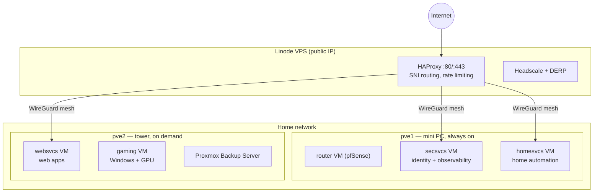

# Building a Private Cloud at Home

A few years ago I started asking an annoying question: how much of my digital life could run on hardware I own? The answer turned out to be "almost all of it" — identity, monitoring, home automation, game streaming, remote access — running on two Proxmox hosts in a closet, with a $5 VPS as the front door.

This post is the tour. Later posts dig into each layer. Everything described here lives in a public repo at [github.com/babraham123/homelab](https://github.com/babraham123/homelab), and the whole system deploys from one command.

<!-- more -->

## The rules I set for myself

Every homelab is shaped by its constraints, so here are mine:

1. **Reproducible from git.** If a machine dies, the repo (plus one encryption key) rebuilds it. No snowflake servers, no "I configured that in a web UI two years ago."
2. **No cloud dependencies** — except one cheap VPS that acts as the public endpoint, because residential ISPs and CGNAT make hosting directly from home miserable.
3. **Small always-on footprint.** The 24/7 hardware sips ~15–20 W. The big machine powers on when needed and stays off otherwise.

## The hardware

**pve1** is a fanless mini PC from AliExpress — a Celeron N5105, 32 GB of RAM, and four 2.5 GbE Intel NICs. It runs 24/7 and hosts the router VM, identity, monitoring, and home automation. It also holds the trust roots (certificate authorities, secrets keys), so it's deliberately the most protected machine in the system.

**pve2** is a custom tower: i5-13500, RTX 3060 Ti for the Windows gaming VM, plus a Tesla P4 (voice pipeline) and a Coral TPU (camera object detection). It idles around 30 W but is usually just... off. An OliveTin button wakes it when I want to game or need the GPU.

**vpn** is the smallest Linode instance money can buy. It's the only machine with a public IP.

## How it fits together

Six VMs, each owning one concern: `router` (pfSense, with all four physical NICs PCI-passed to it), `secsvcs` (Authelia, LLDAP, the metrics stack), `homesvcs` (Home Assistant, MQTT, Zigbee), `websvcs` (user-facing apps), `devtop` (Linux desktop), and `gaming` (Windows with GPU passthrough).

Why VMs instead of containers straight on the host? Blast radius. Each VM gets its own Traefik ingress, its own container subnet, and its own snapshot schedule. A bad deploy or a compromise stays contained.

Inside the three "container VMs" run ~30 services as Podman quadlets — systemd unit files that happen to be containers. No Kubernetes, no Compose daemon. That decision gets [its own post](podman-quadlets.md).

## Traffic: the three-tier front door

Public requests cross three layers:

1. **HAProxy on the VPS** inspects the TLS SNI and routes the *still-encrypted* stream — it never terminates TLS. Rate limiting and geo-blocking happen here.
2. **A WireGuard mesh** (self-hosted Headscale) carries traffic from the VPS to the home VMs. The home network never accepts inbound connections directly.
3. **Traefik on each VM** terminates TLS and enforces SSO before anything reaches a service.

The nice trick is split-horizon DNS: inside the house, Unbound resolves the same hostnames straight to the VMs, so internal traffic skips the VPS entirely. One URL, works everywhere.

## One command to deploy

The repo is Jinja2 templates all the way down. `render_src.sh` fills in variables from a single `vars.yml`, and a set of parse scripts auto-generate the boring parts: DNS records from Traefik routes, metrics scrape targets from service configs, sudoers entries from the command whitelist. Validation (YAML lint, duplicate-IP checks) runs before anything ships, then `deploy_src.sh` pushes to every node.

Secrets are committed to git too — encrypted with SOPS + AGE, decrypted only in memory at container startup. There's no Ansible, no agents; remote automation goes through an SSH forced-command dispatcher that can only run a whitelisted set of actions. Both are stories for later posts.

## Honest gaps

I'd love to tell you this is a zero-trust network. It isn't, yet. The group-based Headscale ACL matrix exists but is disabled (a FreeBSD SNAT limitation mangles source IPs on subnet routes), so mesh policy is currently permissive and real enforcement comes from VLAN firewall rules and the SSO layer. Wired VLAN segmentation is waiting on a managed switch. Backups cover VM disks but not yet file-level restores.

Writing the gaps down turned out to be as useful as writing the architecture down — half of them became tracked issues with actual plans.

## What's next

The rest of this series goes deep on individual layers: quadlets, SSO, secrets, the HAProxy edge, Headscale, VLANs and mDNS (twice — the second time is a debugging story), observability, and streaming games off a headless VM. Stay tuned.
