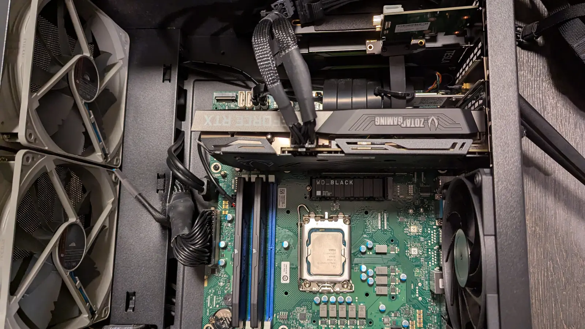
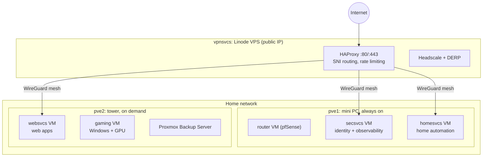

# Building a Private Cloud at Home

Almost all of my digital life runs on hardware I own: identity, monitoring, home automation, game streaming, and remote access. It fits on two Proxmox hosts in a closet, with a $5 VPS handling public traffic. If you're planning a homelab of your own, this is the architecture and the tradeoffs behind it.

This post is an overview, and later posts cover each layer in more detail. Everything described here is in a public repo at [github.com/babraham123/homelab](https://github.com/babraham123/homelab), and the whole system deploys with one command.

<!-- more -->

<figure class="post-hero" markdown>
{ width="1600" height="900" loading="lazy" }
<figcaption>Photo by me: homelab hardware with its side panel off, which is how it spends a surprising amount of time.</figcaption>
</figure>

## Ground rules

Every homelab is shaped by its constraints. These are mine:

1. **Reproducible from code.** If a machine dies, the repo, my variables file, and the encrypted secrets kept on pve1 can rebuild it. There are no hand-configured servers and no settings I clicked through in a web UI two years ago and forgot about.
2. **No cloud dependencies,** with one exception: a cheap VPS that serves as the public endpoint, because residential ISPs and CGNAT make hosting directly from home miserable.
3. **Low power use.** The always-on hardware draws about 15-20 W. The larger machine is turned on when it's needed and stays off otherwise.

## The hardware

**pve1** is a fanless mini PC from AliExpress with a Celeron N5105, 32 GB of RAM, and four 2.5 GbE Intel NICs. It runs 24/7 and hosts the router VM, identity, monitoring, and home automation. It also holds the trust roots (certificate authorities and secrets keys), so it's the most locked-down machine in the system.

**pve2** is a custom tower with an i5-13500 and an RTX 3060 Ti for the Windows gaming VM. It idles around 30 W, but it's usually turned off. An OliveTin button wakes it up when I want to play games or need the GPU.

**vpnsvcs** is the smallest Linode instance available, and it's the only machine with a public IP.

## How it fits together

```mermaid
flowchart TB
    inet(("Internet"))
    subgraph vps["vpnsvcs: Linode VPS (public IP)"]
        haproxy["HAProxy :80/:443<br/>SNI routing, rate limiting"]
        headscale["Headscale + DERP"]
    end
    subgraph home["Home network"]
        subgraph pve1["pve1: mini PC, always on"]
            router["router VM (pfSense)"]
            secsvcs["secsvcs VM<br/>identity + observability"]
            homesvcs["homesvcs VM<br/>home automation"]
        end
        subgraph pve2["pve2: tower, on demand"]
            websvcs["websvcs VM<br/>web apps"]
            gaming["gaming VM<br/>Windows + GPU"]
            pbs["Proxmox Backup Server"]
        end
    end
    inet --> haproxy
    haproxy -- "WireGuard mesh" --> secsvcs
    haproxy -- "WireGuard mesh" --> homesvcs
    haproxy -- "WireGuard mesh" --> websvcs
```

There are six VMs, each with a single job. The diagram leaves out `devtop`, a Linux desktop that shares pve2's GPU with the gaming VM.

I use VMs instead of running containers directly on the host to contain the blast radius if something goes wrong. Each VM has its own Traefik ingress and container subnet, so a bad deploy or a compromise stays inside one VM.

The three VMs that run containers host about 30 services as Podman quadlets, which are systemd unit files that run containers. There's no Kubernetes and no Compose daemon. I'll cover the 'why' behind that in [a dedicated post](podman-quadlets.md).

## How traffic gets in

Public requests pass through three layers:

1. **HAProxy on the VPS** reads the TLS SNI and routes the still-encrypted stream. It never terminates TLS. Rate limiting and geo-blocking also happen here.
2. **A WireGuard mesh** (self-hosted Headscale) carries traffic from the VPS to the VMs at home. The home router drops all direct inbound traffic.
3. **Traefik on each VM** terminates TLS and requires SSO before a request reaches any service.

Inside the house, split-horizon DNS lets Unbound resolve the same hostnames directly to the VMs, so internal traffic never goes through the VPS. The same URL works both at home and away.

## One command to deploy

The repo is built from Jinja2 templates. `render_src.sh` fills in variables from a single `vars.yml`, plus a small node inventory (`src/nodes.yml`) that lists each machine's services and commands. That list generates all the boilerplate: DNS and SNI routing entries, uptime checks, OliveTin buttons, and the sudoers and dispatcher whitelists. After a validation pass, `deploy_src.sh` pushes everything to every node.

Secrets stay out of git. Each host has its own file encrypted with SOPS and AGE, and secrets get decrypted on the fly when a container boots. There's no Ansible and there are no agents. Remote automation goes through an SSH forced-command dispatcher that can only run a strict allowlist of actions. Both have their own posts: [secrets](encrypted-secrets.md) and [the dispatcher](ssh-dispatcher.md).

## Known gaps

I wouldn't call this a true zero-trust network yet. The Headscale ACL policy is written but not enabled yet, so for now the mesh is permissive, and the real enforcement comes from VLAN firewall rules and the SSO layer. Wired VLAN segmentation is waiting on a managed switch. The VPS isn't monitored yet, and most alert rules still only watch the monitoring stack itself.
