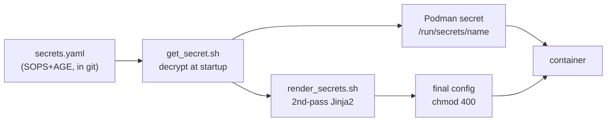

# Every Secret in My Homelab Is Committed to Git

That headline is designed to make security people twitch, so let me finish the sentence: every secret is committed to git *encrypted*, with SOPS and AGE, and plaintext never touches a disk anywhere in the pipeline.

This is the piece that makes "the whole homelab is reproducible from the repo" actually true. Config without secrets is only half a system.

<!-- more -->

## Why not just use Vault?

The standard answer for secrets management is HashiCorp Vault, and for a team it's the right one. For a single operator it's a lot: a stateful, always-on service with its own unsealing ritual and availability story — a critical dependency that exists to serve... me. I wrote this down as an architecture decision record so future-me stops relitigating it.

The alternative: encrypt the secrets *into the repo* and make decryption a host-local operation.

- **AGE** is modern file encryption without GPG's baggage — small keypairs, no keyservers, one obvious way to use it.
- **SOPS** encrypts only the *values* in a YAML file, leaving the keys readable. Diffs stay meaningful: you can see *that* `authelia_smtp_password` changed and when, without ever seeing what it is.

Each VM has its own AGE keypair. The private key lives only on that host — it's the one thing that isn't in git. Repo + secrets file + one key = a fully rebuilt node.

## The pipeline: from ciphertext to container

The interesting engineering is getting decrypted values into containers without ever parking plaintext on disk. Two paths:

**Path 1: Podman secrets.** The quadlet declares `Secret=name,type=env,...`; at startup the secret is decrypted and handed to the container. It shows up at `/run/secrets/<name>` or as an env var inside the container — but not in `podman inspect`, not in the unit file, not in the process command line.

**Path 2: the `*.j2.j2` double template.** Some apps insist on secrets inside a config file (database URLs, API keys). Those configs are Jinja2 templates *twice over*:

- **Pass 1, deploy time:** `render_src.sh` fills in the boring variables — IPs, hostnames, usernames. The output still contains `{{ secret_placeholders }}` and ships to the host like that.
- **Pass 2, container startup:** an `ExecStartPre=` hook decrypts the needed values, renders the final file, and locks it to `chmod 400`.

Between deploy and runtime, the file on disk is a template with holes in it. The plaintext exists in memory, briefly, on the machine that needs it. That's the whole trick.

## Day-to-day ergonomics

This sounds elaborate but daily use is one command: `sops secrets.yaml` opens the decrypted file in `$EDITOR` and re-encrypts on save. Adding a secret is: add the value there, reference it from a template or quadlet, redeploy. Git history shows every change (but no values).

## Tradeoffs, honestly

- **The AGE key is a single point of failure.** Lose a host's private key and that host's secrets are gone. Keys need real backup discipline (mine live in exactly two offline places).
- **No audit log.** Vault tells you who read what and when; a file has no opinions. Fine for one operator, disqualifying for a team.
- **Rotation is re-render + restart**, not a hot swap. At homelab scale that's a non-issue.

What I get in exchange: zero extra services, no unsealing ceremony at 2 AM, and a repo that is *actually* the whole system — the property everything else in this series builds on.

Scripts are in [the repo](https://github.com/babraham123/homelab): `get_secret.sh`, `render_secrets.sh`, and the ADR that explains the choice.
