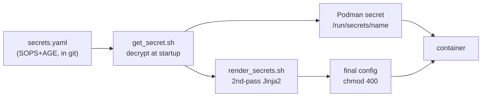

# Every Secret in My Homelab Is Committed to Git

That title will probably make security people nervous, so here's the rest of the sentence: every secret is committed to git encrypted with SOPS and AGE, and plaintext is never written to disk anywhere in the pipeline.

This is what makes it true that the whole homelab can be rebuilt from the repo. Config without secrets is only half of a working system.

<!-- more -->

## Why not just use Vault?

The standard tool for managing secrets is HashiCorp Vault, and it's the right choice for a team. For one person it's a lot. It's a stateful, always-on service with its own unsealing process and its own uptime to worry about, and it would be a critical dependency whose only user is me. I wrote this up as an architecture decision record so I'd stop reopening the question.

The alternative is to encrypt the secrets into the repo and make decryption something that happens locally on each host.

- **AGE** is a modern file encryption tool without GPG's complexity. It has small keypairs, no keyservers, and one straightforward way to use it.
- **SOPS** encrypts only the values in a YAML file and leaves the keys readable. That keeps diffs useful: you can see that `authelia_smtp_password` changed and when, without seeing the password.

Each VM has its own AGE keypair. The private key exists only on that host, and it's the one thing not stored in git. With the repo, the secrets file, and that key, a node can be fully rebuilt.

## The pipeline: from ciphertext to container

The interesting part is getting decrypted values into containers without ever writing plaintext to disk. There are two ways this happens:

**Path 1: Podman secrets.** The quadlet declares `Secret=name,type=env,...`. At startup the secret is decrypted and passed to the container, where it appears at `/run/secrets/<name>` or as an environment variable. It doesn't show up in `podman inspect`, in the unit file, or on the process command line.

**Path 2: the `*.j2.j2` double template.** Some apps require secrets inside a config file, such as database URLs or API keys. Those configs are Jinja2 templates that get rendered twice:

- **Pass 1, at deploy time:** `render_src.sh` fills in the non-secret variables like IPs, hostnames, and usernames. The output still contains `{{ secret_placeholders }}` and is shipped to the host that way.
- **Pass 2, at container startup:** an `ExecStartPre=` hook decrypts the values it needs, renders the final file, and sets it to `chmod 400`.

Between deploy and startup, the file on disk is a template with the secrets still missing. The plaintext only exists briefly, in memory, on the machine that needs it.

## Day-to-day use

This sounds complicated, but day to day it's one command. `sops secrets.yaml` opens the decrypted file in `$EDITOR` and re-encrypts it when you save. To add a secret, I add the value there, reference it from a template or quadlet, and redeploy. Git history records every change without exposing any values.

## Tradeoffs

- **Each AGE key is a single point of failure.** If a host's private key is lost, that host's secrets are gone. The keys need to be backed up carefully, and mine are stored in two offline locations.
- **There's no audit log.** Vault records who read which secret and when, but a file can't do that. That's fine for one person and a dealbreaker for a team.
- **Rotation means re-rendering and restarting,** not a live swap. At homelab scale that isn't a problem.

In return, I don't run any extra services, I never have to unseal anything at 2 AM, and the repo really does contain the whole system. The rest of this series depends on that.

The scripts are in [the repo](https://github.com/babraham123/homelab): `get_secret.sh`, `render_secrets.sh`, and the ADR that explains the decision.
