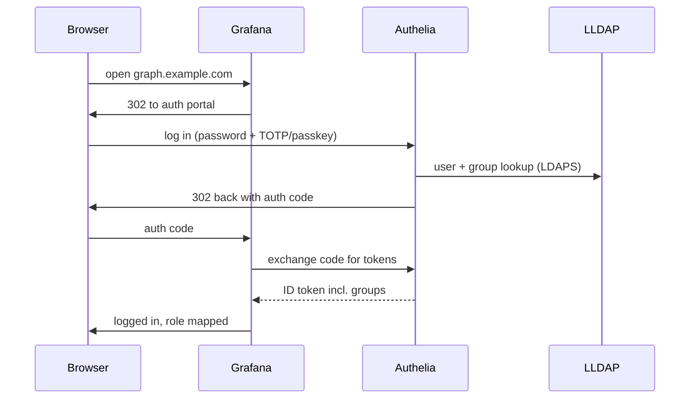

# One Login for Everything: Self-Hosted SSO with Authelia and LLDAP

Once a homelab grows past a handful of services, authentication becomes the most annoying part. Every app has its own password database, its own approach to 2FA, and its own session length. The fix is what companies use: single sign-on. You get one account, one login page, and one 2FA prompt for every service.

Mine is built from LLDAP, Authelia, and Traefik. It's all self-hosted, with no "Sign in with Google" anywhere.

<!-- more -->

## The stack

**LLDAP** is the user directory. It stores users and groups and has a clean web UI, without the decades of complexity that come with OpenLDAP. **Authelia** does most of the work. It reads users from LLDAP, serves the login portal, handles TOTP and passkeys, and acts as an OIDC provider. It's backed by **Postgres** so sessions survive restarts. **Traefik** enforces all of this by refusing to pass a request upstream until Authelia approves it.

## Two ways to protect an app

Apps fall into two groups, and the stack supports both.

**ForwardAuth** is for apps that don't have real authentication of their own. Traefik sends each incoming request to Authelia first. If the session is valid, Authelia returns a `200` and the request goes through. Otherwise it returns a `302` to the login portal. Adding this to a service takes one middleware line in its Traefik config, and it's the default for everything.

**OIDC** is for apps that support delegated login themselves. There are currently six: Headscale, Grafana, Home Assistant, Guacamole, Gatus, and OliveTin. OIDC takes more work per app, but it lets you map roles. Grafana reads your groups from the ID token, so LDAP group membership decides who is an admin and who is a viewer.

## Access control: default deny

Authelia's access rules start with `default_policy: deny` and allow specific routes from there, with stricter requirements for more sensitive ones. Some routes need one factor, and admin routes need two. TOTP and WebAuthn/passkeys are both enabled, and password strength is checked with zxcvbn instead of arbitrary complexity rules.

The secrets this depends on (the LDAP bind password, OIDC HMAC key, issuer private key, and storage encryption key) never appear in config files on disk. They're injected when the container starts from an encrypted store, which is covered in [a separate post](encrypted-secrets.md).

## Lessons learned

**Start with ForwardAuth everywhere and add OIDC only where you need it.** ForwardAuth takes about ten minutes per app. OIDC takes an hour of reading each app's docs and fighting with its redirect handling. It's only worth it where group-based roles matter.

**Most OIDC failures come from `redirect_uri` mismatches.** The URI registered in Authelia has to match what the app sends exactly, including scheme, host, and path. After any TLS or domain change, check this before looking at certificates.

**Authelia's startup errors often point at the wrong thing.** In my experience the actual problem is usually the LDAP or SMTP connection, regardless of what the error message says. Keeping a one-liner that runs Authelia locally with debug environment variables saved me hours of restarting containers.

**Debugging LDAPS is miserable.** It was bad enough that TLS debugging across this stack got [its own post](tls-debugging.md). I should also admit that mutual TLS between LLDAP and Authelia is still disabled while I sort out a certificate CN issue. The connection is encrypted, but client certificates are still on the TODO list.

## Results

Setting this up was worth it. Adding a new service now means adding a Traefik route and the auth middleware, and it's protected by the same login and 2FA as everything else. Family members each get one account with the groups they need. None of my identity data, sessions, or login history leaves hardware I own.

The configs are in [the repo](https://github.com/babraham123/homelab) under `src/authelia/` and `src/lldap/`.
