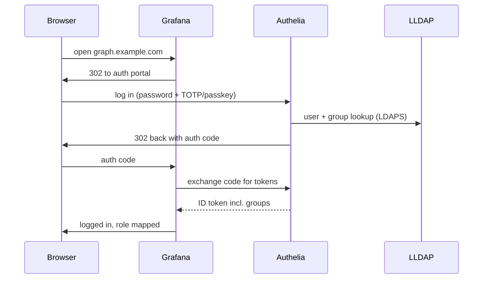

# One Login for Everything: Self-Hosted SSO with Authelia and LLDAP

The moment a homelab grows past a handful of services, auth becomes the worst part. Every app has its own password database, its own idea of 2FA, its own session length. The fix is the same one companies use: single sign-on. One account, one login page, one 2FA prompt, every service.

Mine is built from LLDAP, Authelia, and Traefik — all self-hosted, no "Sign in with Google" anywhere.

<!-- more -->

## The stack, in one paragraph

**LLDAP** is the user directory: users and groups, a clean web UI, none of OpenLDAP's forty years of ceremony. **Authelia** is the brain: it reads users from LLDAP, serves the login portal, handles TOTP and passkeys, and acts as an OIDC provider — backed by **Postgres** so sessions survive restarts. **Traefik** is the enforcement point: it won't pass a request upstream until Authelia says yes.

## Two ways to protect an app

Apps fall into two buckets, and the stack handles both.

**ForwardAuth** is for apps with no real auth of their own. Traefik forwards every incoming request to Authelia first; a valid session gets a `200` and the request proceeds, anything else gets a `302` to the login portal. Adding this to a service is one middleware line in its Traefik config. This is the default for everything.

**OIDC** is for apps that support delegated login natively — currently six clients: Headscale, Grafana, Home Assistant, Guacamole, Gatus, and OliveTin. OIDC is more work per app but buys you role mapping: Grafana learns your *groups* from the ID token, so LDAP group membership decides who's an admin and who's a viewer.

## Access control: default deny

Authelia's access rules start from `default_policy: deny` and whitelist from there, escalating by sensitivity: some routes need one factor, admin-ish routes need two. TOTP and WebAuthn/passkeys are both enabled, and password policy runs through zxcvbn rather than arbitrary complexity rules.

The secrets involved — LDAP bind password, OIDC HMAC key, issuer private key, storage encryption key — never appear in config files on disk. They're injected at container startup from an encrypted store, which is [its own story](secrets-in-git.md).

## Lessons learned the slow way

**Start with ForwardAuth everywhere; add OIDC selectively.** ForwardAuth is ten minutes of work per app. OIDC is an hour of reading each app's docs and arguing with its redirect handling. Only bother where group-based roles matter.

**`redirect_uri` mismatches cause most OIDC failures.** The URI registered in Authelia must match what the app sends *exactly* — scheme, host, path. After any TLS or domain change, check this first, not the certs.

**Authelia's startup errors often point at the wrong thing.** In my experience the real problem is usually the LDAP or SMTP connection, whatever the error says. Having a one-liner to run Authelia locally with debug env vars saved me hours of container-restart loops.

**LDAPS debugging is miserable** — enough that TLS debugging across this stack became [a separate post](tls-debugging.md). (Confession from the known-gaps file: LLDAP↔Authelia *mutual* TLS is still disabled pending a certificate CN fix. The link is encrypted; the client-cert half is a TODO.)

## Was it worth it?

Absolutely. New service setup is now: add a Traefik route, tag the auth middleware, done — protected by the same login and 2FA as everything else. Family members get one account with the groups they need. And nothing about my identity, sessions, or login history leaves hardware I own.

Configs are in [the repo](https://github.com/babraham123/homelab) under `src/authelia/` and `src/lldap/`.
