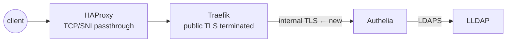

# The TLS Rabbit Hole: Debugging Auth Failures Across Three Proxies

I enabled TLS on an internal service and broke SSO logins for half the homelab. The error showed up in Grafana, the logs pointed at Traefik, and the actual bug was a certificate two hops away. This post tells that story, but it's mostly about the debugging process I wish I'd used from the start, because with several layers of proxies, TLS failures tend to show up far from their cause.

<!-- more -->

## The setup

Requests in my lab pass through three layers. HAProxy forwards encrypted streams based on SNI, Traefik terminates public TLS, and behind Traefik, internal services talk to each other over TLS using certificates from a private CA. The change I made was switching Authelia (the SSO provider) to serve its internal endpoint over TLS instead of plain HTTP.

After that, the Authelia login page loaded fine, but OIDC clients like Grafana got 502s and handshake errors. Some things worked and some didn't, which is the most annoying kind of failure.



Each arrow is a separate trust relationship, and any of them can fail on its own. So the important rule is: **don't start debugging at the layer where the symptom appears. Work through the chain from the inside out.**

## The process

**Layer 0: does the service itself serve TLS correctly?** Test from its own VM:

```bash
curl -vvv --cacert internal-ca.pem https://10.10.0.5:9091/
```

**Layer 1: can the next hop verify it?** Traefik's logs mentioned certificate verification failures. That means either the CA isn't trusted or the certificate doesn't cover the name being connected to.

**Look at the certificate that's actually being served,** not the one you think you deployed:

```bash
openssl s_client -connect 10.10.0.5:9091 -CAfile internal-ca.pem
openssl x509 -in cert.pem -text -noout   # read the SAN list!
```

That's where I found the problem. The cert's subject was the internal hostname, but Traefik was connecting to the container's IP, and the IP wasn't in the SAN list. Modern TLS ignores the CN field completely, so if the name you connect to isn't in the SANs, verification fails no matter what else is right. I reissued the cert with both the hostname and the IP in the SANs and redistributed it, which fixed the first bug.

## The second bug

Logins still failed, but with a different error, which at least meant progress. Authelia was now logging `redirect_uri did not match any registered URIs`, because Grafana's OIDC registration still had the callback URL from before the TLS change. The browser showed the same symptom as the certificate problem, but the cause was completely unrelated. TLS errors and OAuth misconfigurations look the same from the outside, and only the logs tell them apart.

There was one more problem after that. Services on the same VM as Authelia couldn't fetch its OIDC discovery document. Their requests to `auth.<domain>` loop back through Traefik, so they needed to trust Traefik's certificate chain, but the internal CA had only been distributed to containers with explicit cert mounts. This applies more broadly: **every client needs to trust the CA, including services you didn't think of as clients.**

## The process, summarized

1. Test each hop separately, from the inside out, using `curl` or `openssl s_client` against each layer directly.
2. At each hop, check two things: whether the CA is trusted, and whether the name you're connecting to is in the SANs.
3. Rule out TLS before changing any OAuth config. The symptoms look similar but the causes are different.
4. Temporarily set Traefik and Authelia logging to DEBUG. The default log levels hide the one line you need.
5. If curl's errors aren't specific enough, run `tcpdump` on the container network and open the capture in Wireshark. It shows exactly which handshake message fails.

## Still unfinished

My original goal was mutual TLS on the LDAP connection, with both server and client certificates. That's still disabled in my config with a `TODO` until I do another round of certificate fixes, so the connection is encrypted but doesn't use client certs. I still think internal TLS is worth doing in a homelab. Each certificate is a small agreement about names and trust, though, and when one side gets it wrong you end up debugging. With this process it takes me minutes instead of whole evenings.
