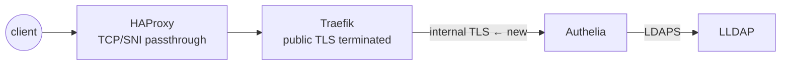

# The TLS Rabbit Hole: Debugging Auth Failures Across Three Proxies

I enabled TLS on an internal service and broke SSO logins for half the homelab. The error appeared in Grafana, the logs pointed at Traefik, and the actual bug was a certificate two hops away. This is a debugging story, but mostly it's the *method* I wish I'd had at the start — because layered proxy stacks make TLS failures show up far from their cause.

<!-- more -->

## The stage

Requests in my lab cross three layers: HAProxy passes encrypted streams by SNI, Traefik terminates public TLS, and behind it, internal services talk TLS with certificates from a private CA. The change: Authelia (the SSO provider) started serving its internal endpoint over TLS instead of plain HTTP.

Result: the Authelia login page loaded fine, but OIDC clients like Grafana got 502s and handshake errors. Half working, half broken — the most annoying kind of broken.



Each arrow is a separate trust relationship, and each can fail independently. That's the key insight: **don't debug the symptom's layer — walk the chain from the inside out.**

## The method

**Layer 0 — does the service itself serve TLS correctly?** From its own VM:

```bash
curl -vvv --cacert internal-ca.pem https://10.10.0.5:9091/
```

**Layer 1 — can the next hop verify it?** Traefik's logs mentioned certificate verification failures — meaning either the CA isn't trusted or *the certificate doesn't cover the name being dialed*.

**Inspect what's actually presented**, rather than what you deployed:

```bash
openssl s_client -connect 10.10.0.5:9091 -CAfile internal-ca.pem
openssl x509 -in cert.pem -text -noout   # read the SAN list!
```

And there it was: the cert's subject named the internal *hostname*, but Traefik was dialing the container *IP* — which wasn't in the SAN list. Modern TLS ignores the CN field entirely; if the name you dial isn't in the SANs, verification fails no matter how correct everything else is. Reissue with both hostname and IP in the SANs, redistribute, one bug down.

## The bug behind the bug

Logins still failed — differently, which in debugging counts as progress. Authelia now logged `redirect_uri did not match any registered URIs`: Grafana's OIDC registration still contained the pre-TLS callback URL. Same browser-level symptom as the cert issue, completely unrelated cause. TLS errors and OAuth misconfigurations *look identical from the outside*; only the logs distinguish them.

Then one final surprise: services on the same VM as Authelia couldn't fetch its OIDC discovery document. Their route to `auth.<domain>` loops back through Traefik, so they needed to trust Traefik's certificate chain — the internal CA had only been distributed to containers with explicit cert mounts. The lesson generalizes: **the CA must be trusted by every client, including the ones you didn't think of as clients.**

## The protocol, distilled

1. Test each hop independently, inside out — `curl`/`openssl s_client` against each layer directly.
2. At each hop check two things: is the CA trusted, and is the *dialed name* in the SANs?
3. Rule out TLS before touching OAuth config — similar symptoms, disjoint causes.
4. Crank Traefik/Authelia logs to DEBUG temporarily; default levels hide the one useful line.
5. When curl's errors go vague, `tcpdump` the container network and read the handshake in Wireshark — it shows exactly which message fails.

## Scar tissue

The original goal was *mutual* TLS on the LDAP link — server and client certs both. That remains disabled in my config behind a `TODO`, pending another round of certificate fixes; the link is encrypted, the client-cert half is not. Internal TLS in a homelab is worth it, but every certificate is a small contract about names and trust, and the debugging bill arrives whenever one party misunderstands the contract. At least now I can pay it in minutes instead of evenings.
