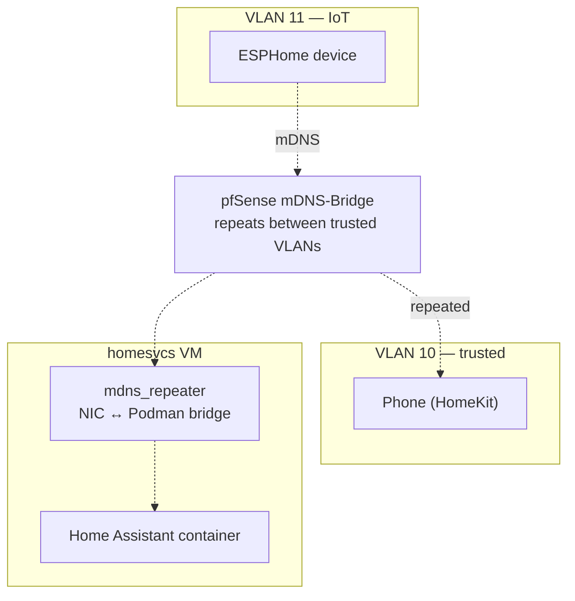

# VLANs Break Your Smart Home (and How to Fix It)

Putting IoT devices on their own VLAN is the most commonly given piece of homelab security advice, and it's correct: a $12 smart plug with abandoned firmware should not share a network with your laptop. What the advice usually skips is what happens next — half your smart home stops working, because device discovery doesn't cross VLANs.

Here's my segmentation design, the mDNS problem it creates, and the three pieces that fix it.

<!-- more -->

## The VLAN layout

pfSense (running as a VM, with the router hardware's four NICs passed through to it) does all routing and tagging. The WiFi access point broadcasts three SSIDs, each tagged onto its own VLAN. A small convention I like: the VLAN ID doubles as the subnet's third octet.

| VLAN | Purpose | Subnet |
|------|---------|--------|
| 10 | Trusted WiFi — phones, laptops | 192.168.10.0/24 |
| 11 | IoT WiFi — bulbs, sensors, plugs | 192.168.11.0/24 |
| 12 | Guest WiFi — internet only | 192.168.12.0/24 |

(Wired VLANs 20/21 are defined and waiting on a managed PoE switch — currently the honest answer to "why is that camera on the trusted network?")

The firewall policy: IoT → trusted is denied by default, with pinholes for the services IoT devices legitimately need (Home Assistant, MQTT). Guest routes to the internet and nowhere else. The AP's own management interface lives on the trusted VLAN.

## The problem: multicast stops at the router

HomeKit, Chromecast, ESPHome, printers — nearly all local discovery runs on mDNS, which is *multicast*. Multicast doesn't cross router boundaries, and every VLAN boundary is a router boundary. So the moment you segment, your phone on VLAN 10 can no longer *find* the speaker on VLAN 11, even if a firewall rule would happily allow the connection.

Allowing inter-VLAN routing doesn't fix this. The packets aren't being blocked; they're never sent across in the first place.

## The fix: three pieces

1. **The pfSense mDNS-Bridge package** repeats mDNS packets between the trusted and IoT VLANs. The guest VLAN is deliberately excluded — guests get internet, not a map of my house.
2. **`mdns_repeater` on the container VMs.** There's a second, sneakier boundary: containers live behind a Podman bridge network *inside* each VM, and multicast doesn't cross that either. A small repeater daemon on the VM bridges its NIC and the container network, so Home Assistant (a container) can discover devices two hops of network topology away.
3. **A firewall rule** allowing UDP/5353 to the multicast range across the bridged VLANs — the repeated packets still have to be *allowed*.

## The gotcha that will get you

If a VM runs `avahi-daemon` (Debian installs it as a dependency of all sorts of things), it silently intercepts mDNS queries before the repeater sees them — no errors anywhere, discovery just fails. Disable Avahi wherever `mdns_repeater` runs. This one cost me an evening, and later a full debugging session that became [its own post](mdns-debugging.md).

For verifying things work, I keep a small Node.js probe script (`test/mdns.js`) that queries a service type from a chosen interface — much faster than restarting Home Assistant and hoping.

## Worth it?

Yes, with a caveat. The security win is real: compromised IoT firmware lands in a network where the interesting targets are unreachable by policy. The cost is that discovery — designed for flat home networks — becomes infrastructure you own and can break. Budget for that before segmenting, not after your household asks why the TV vanished from the cast menu.
