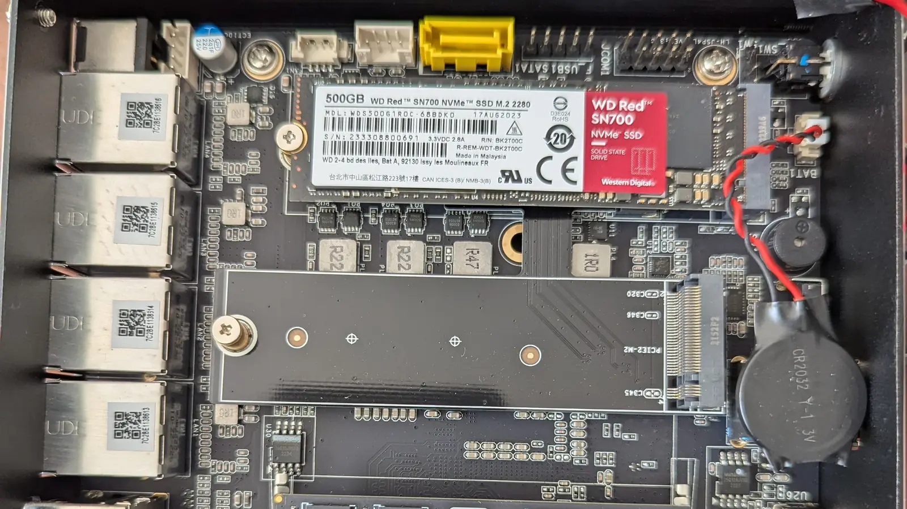
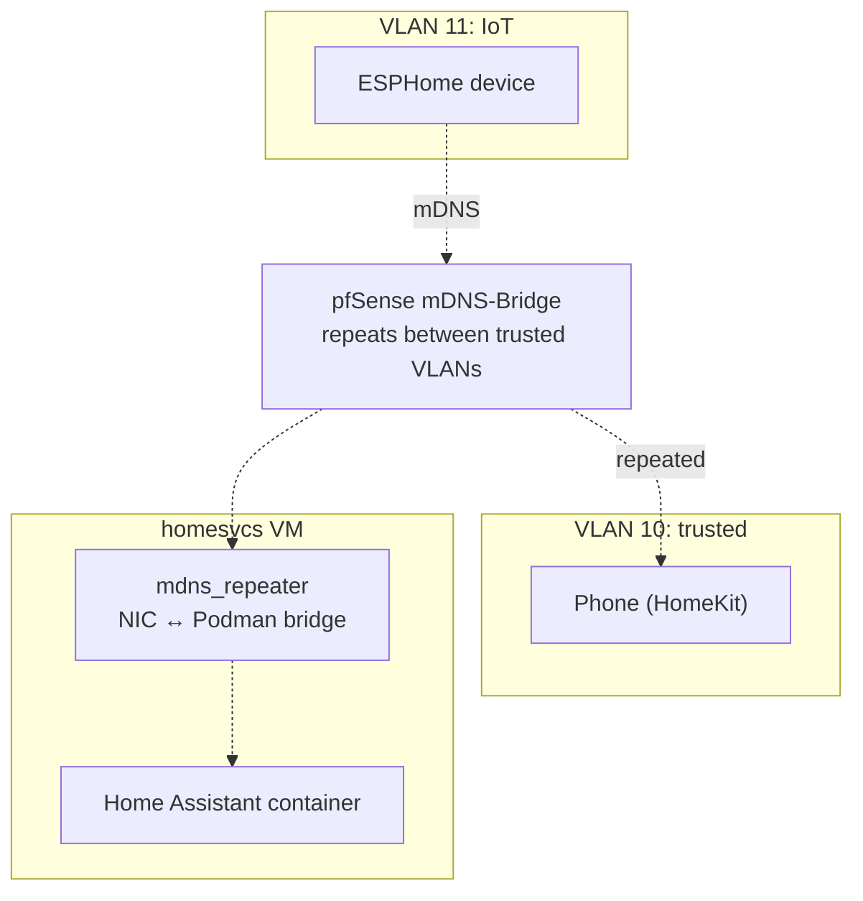

# VLANs Break Your Smart Home (and How to Fix It)

Putting IoT devices on their own VLAN is one of the most common pieces of homelab security advice, and it's good advice. A $12 smart plug with abandoned firmware shouldn't share a network with your laptop. What the advice usually leaves out is that half your smart home stops working afterward, because device discovery doesn't cross VLANs.

This post covers my segmentation design, the mDNS problem it causes, and the three things I did to fix it.

<!-- more -->

<figure class="post-hero" markdown>
{ width="1600" height="900" loading="lazy" }
<figcaption>Photo by me: the mini PC that runs my router, opened up to show off its four network ports.</figcaption>
</figure>

## The VLAN layout

pfSense runs as a VM with the router hardware's four NICs passed through to it, and it handles all routing and tagging. The WiFi access point broadcasts three SSIDs, each tagged onto its own VLAN. I use the VLAN ID as the third octet of the subnet, which makes things easy to remember.

| VLAN | Purpose | Subnet |
|------|---------|--------|
| 10 | Trusted WiFi: phones, laptops | 192.168.10.0/24 |
| 11 | IoT WiFi: bulbs, sensors, plugs | 192.168.11.0/24 |
| 12 | Guest WiFi: internet only | 192.168.12.0/24 |

(Wired VLANs 20 and 21 are defined but waiting on a managed PoE switch. That's also why the camera is currently on the trusted network.)

For firewall policy, traffic from IoT to trusted is denied by default, with exceptions for the services IoT devices actually need (Home Assistant and MQTT). The guest network can reach the internet and nothing else. The AP's management interface is on the trusted VLAN.

## The problem: multicast stops at the router

HomeKit, Chromecast, ESPHome, and printers almost all use mDNS for local discovery, and mDNS is multicast. Multicast traffic doesn't cross routers, and every VLAN boundary is a router. As soon as you segment the network, your phone on VLAN 10 can't find the speaker on VLAN 11, even if a firewall rule would allow the connection.

Allowing routing between VLANs doesn't help. The packets aren't being blocked. They're never forwarded to the other VLAN at all.

## The fix, in three parts

1. **The pfSense mDNS-Bridge package** repeats mDNS packets between the trusted and IoT VLANs. The guest VLAN is left out on purpose, since guests should get internet access and not a list of every device in my house.
2. **`mdns_repeater` on the container VMs.** There's a second, less obvious boundary here. Containers sit behind a Podman bridge network inside each VM, and multicast doesn't cross that either. A small repeater daemon on the VM connects its NIC to the container network, so Home Assistant, which runs in a container, can discover devices two network hops away.
3. **A firewall rule** that allows UDP/5353 to the multicast range across the bridged VLANs. The repeated packets still need to be allowed through.

## Watch out for Avahi

If a VM is running `avahi-daemon` (Debian installs it as a dependency of many packages), it will intercept mDNS queries before the repeater sees them. There are no errors anywhere, and discovery just stops working. Disable Avahi on any machine that runs `mdns_repeater`. This cost me an evening the first time, and later a full debugging session that turned into [its own post](mdns-debugging.md).

To check that discovery is working, I keep a small Node.js probe script (`test/mdns.js`) that queries for a service type from a chosen interface. It's much faster than restarting Home Assistant and hoping for the best.

## Is it worth it?

Yes, with one caveat. The security benefit is real: if an IoT device's firmware is compromised, it's on a network where the valuable targets are blocked by policy. The downside is that discovery, which was designed for flat home networks, becomes infrastructure you have to maintain and can break. Plan for that before you segment your network, not after someone in your house asks why the TV disappeared from the cast menu.
